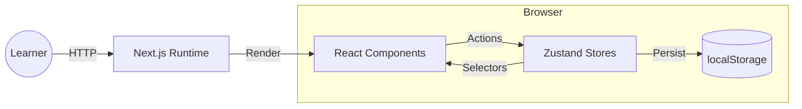
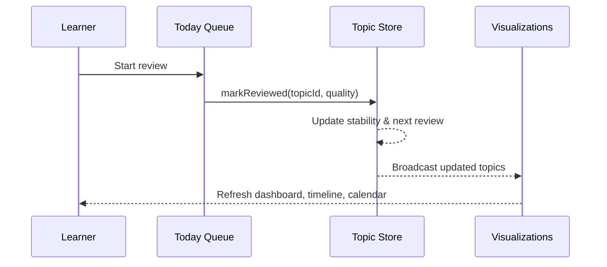

# Spaced Repetition App

> Local-first spaced repetition studio built with Next.js, Tailwind CSS, and Zustand to help learners plan, review, and track subjects.

## Table of Contents
- [Overview](#overview)
- [Screenshots & Visuals](#screenshots--visuals)
- [Key Features](#key-features)
- [Installation & Setup](#installation--setup)
- [Usage / Quickstart](#usage--quickstart)
- [Architecture / Design Overview](#architecture--design-overview)
- [Example Outputs or Results](#example-outputs-or-results)
- [Contributing](#contributing)
- [License](#license)
- [Acknowledgments](#acknowledgments)

## Overview
Spaced Repetition App ships as an offline-first Next.js 14 experience. The navigation shell keeps Today’s queue, analytics dashboards, per-subject planners, and settings within reach while Zustand stores persist every change to `localStorage`. Demo data from `src/data/demo-seed-data.json` gives newcomers an immediate sandbox to explore review pacing, exam countdowns, and timeline analytics.

<!-- IMAGE: HERO_TODAY_QUEUE | hero_today_queue.png | alt="Today page showing retention-aware review queue and progress tracker" | caption="Triage today's reviews with retention forecasts, difficulty tags, and quick-complete controls." | size="1440x900" -->

## Screenshots & Visuals
### Today
Shows subjects with least retention, so user can focus on these first.


### Dashboard Status Filters
A condensed analytics hub showing due counts, risk badges, and compact calendar heatmaps for the next month.


### Timeline Analytics
Zoomable forgetting curves with per-topic overlays, fullscreen subject grids, and export controls.


### Calendar Planner
Subject-aware monthly planner with daily sheets, quick revise, and exam markers.


### Subjects & History
Manage subject branding, countdowns, and retroactive history edits with merge conflict warnings.


## Architecture / Design Overview
- **Framework**: Next.js 14 App Router with a persistent layout (`src/app/layout.tsx`) that injects global theme tokens (`src/styles/theme.css`, `src/styles/globals.css`), the navigation bar, and toast provider.
- **State**: Modular Zustand stores persisted to `localStorage` (`src/stores/topics.ts`, `src/stores/profile.ts`, `src/stores/review-preferences.ts`, `src/stores/timeline-preferences.ts`) keep the app offline-first. Each store includes migrations to keep older snapshots valid.
- **Scheduling Engine**: `src/lib/forgetting-curve.ts` and `src/lib/adaptive-scheduler.ts` implement the retention model, risk scoring, and adaptive interval projections; topics call these helpers when reviews are marked or history is replayed.
- **Data Derivation**: Selectors (e.g., `src/selectors/curves.ts`) and helpers (`src/lib/calendar.ts`) provide memoized aggregates such as per-subject summaries, month heatmaps, and export-ready curve samples.
- **UI System**: Tailwind utility classes are combined with semantic component wrappers (`src/components/ui/*`) plus Radix primitives for popovers, selects, overlays, and dialogs. Lucide icons and Framer Motion animate hover cues and modals.
- **Docs**: Deep dives live in `docs/` — start with `docs/DOCS_INDEX.md`, architecture notes (`docs/core/ARCHITECTURE.md`), forgetting-curve math (`docs/core/ALGORITHMS_FORGETTING_CURVE.md`), and UI guidelines (`docs/ui/UI_GUIDELINES.md`).


## Key Features
- Adaptive Today queue with retention scoring, difficulty overrides, and safety rails that prevent multiple same-day reviews (`src/app/today/page.tsx`, `src/stores/today.ts`).
- Dashboard and Reviews tables that blend risk analytics, streak tracking, and subject filters backed by `computeRiskScore` and calendar summaries (`src/components/dashboard/topic-list.tsx`).
- Interactive timeline visualizations featuring per-subject grids, zoom/pan gestures, and SVG/PNG exports powered by `timeline-panel.tsx` and `downloadSvg`.
- Calendar surface with subject-aware filters, daily sheets, and “revise now” moderation that respects the once-per-day lock (`src/components/calendar/calendar-view.tsx`).
- Subjects admin area for managing colors, icons, exam targets, and deep history edits with replayed forgetting curves (`src/app/subjects/page.tsx`, `src/components/topics/history-editor.tsx`).
- Settings that tune adaptive parameters (review trigger, growth α/β), notification preferences, and appearance overlays (`src/app/settings/page.tsx`, `src/stores/appearance.ts`).
- Automatic rollover that bumps unfinished cards into the upcoming queue at local midnight via `useAutoSkipOverdue`.

## Installation & Setup
1. Ensure Node.js 18+ and npm are installed.
2. Clone the repository and install dependencies:
   ```bash
   npm install
   ```
3. Run the development server:
   ```bash
   npm run dev
   ```
4. Visit `http://localhost:3000` — the home route renders the Today queue (`src/app/(pages)/page.tsx` delegates to Today).

## Usage / Quickstart
- Seeded demo data offers ready-made subjects and topics. Create or edit entries via the Subjects page; `TopicForm` guides you through a three-step wizard.
- Start reviews from Today or open the Quick Revision dialog from the calendar; difficulty choices feed `adjustNextReviewByMultiplier` for precise scheduling.
- Tailor adaptive behaviour in Settings — updating the review trigger immediately recalculates future intervals through `useReviewPreferencesStore`.
- Export timeline snapshots (`FileDown`, `ImageDown` actions) for planning sessions, or filter subjects to drill into target exams.
- Quality gates:
  - `npm run lint` for code quality.
  - `npm run test:curve` to validate the forgetting-curve maths (`tests/forgetting-curve.test.ts`).
  - `npm run test:visual` for Playwright UI coverage (headless smoke of dashboard & timeline).

## Architecture / Design Overview
- **Framework**: Next.js 14 App Router with a persistent layout (`src/app/layout.tsx`) that injects global theme tokens (`src/styles/theme.css`, `src/styles/globals.css`), the navigation bar, and toast provider.
- **State**: Modular Zustand stores persisted to `localStorage` (`src/stores/topics.ts`, `src/stores/profile.ts`, `src/stores/review-preferences.ts`, `src/stores/timeline-preferences.ts`) keep the app offline-first. Each store includes migrations to keep older snapshots valid.
- **Scheduling Engine**: `src/lib/forgetting-curve.ts` and `src/lib/adaptive-scheduler.ts` implement the retention model, risk scoring, and adaptive interval projections; topics call these helpers when reviews are marked or history is replayed.
- **Data Derivation**: Selectors (e.g., `src/selectors/curves.ts`) and helpers (`src/lib/calendar.ts`) provide memoized aggregates such as per-subject summaries, month heatmaps, and export-ready curve samples.
- **UI System**: Tailwind utility classes are combined with semantic component wrappers (`src/components/ui/*`) plus Radix primitives for popovers, selects, overlays, and dialogs. Lucide icons and Framer Motion animate hover cues and modals.
- **Docs**: Deep dives live in `docs/` — start with `docs/DOCS_INDEX.md`, architecture notes (`docs/core/ARCHITECTURE.md`), forgetting-curve math (`docs/core/ALGORITHMS_FORGETTING_CURVE.md`), and UI guidelines (`docs/ui/UI_GUIDELINES.md`).

### System Context


### Review Flow


## Example Outputs or Results
Adaptive checkpoints illustrate how stability growth widens intervals while respecting exam caps:

```ts
import { projectAdaptiveSchedule } from "@/lib/adaptive-scheduler";

const checkpoints = projectAdaptiveSchedule({
  anchorDate: new Date("2024-01-01T00:00:00.000Z"),
  stabilityDays: 1,
  reviewsCount: 0,
  reviewTrigger: 0.5,
  examDate: new Date("2024-01-10T00:00:00.000Z")
});

console.table(checkpoints.slice(0, 3));
/*
index | date                       | intervalDays | stabilityDays | retention
1     | 2024-01-01T16:37:55.000Z   | 0.693        | 1.000          | 0.500
2     | 2024-01-02T13:37:33.000Z   | 0.875        | 1.263          | 0.500
3     | 2024-01-04T01:07:42.000Z   | 1.479        | 2.133          | 0.500
*/
```

Run the unit suite to verify forgetting-curve behaviour:

```bash
npm run test:curve
# → Validates stability updates, retention floors, lapse penalties, and exam-bound schedules.
```

## Contributing
- Review `CONTRIBUTING.md` and `CODE_OF_CONDUCT.md` for guidelines.
- Follow the Tailwind conventions already in place; extract semantic components when markup grows complex.
- Preserve TypeScript strictness — fix types instead of downgrading to `any`.
- Document notable behavioural changes in PR descriptions and ensure lint/tests pass (`npm run lint`, `npm run test:curve`, `npm run test:visual`).

## License
Distributed under the MIT License. See `LICENSE.md` for details.

## Acknowledgments
- Built on Next.js, React 18, Tailwind CSS, Zustand, Radix UI, Lucide, Framer Motion, and Sonner.
- The adaptive scheduling model is inspired by SuperMemo-style forgetting curves — see `docs/core/ALGORITHMS_FORGETTING_CURVE.md` for derivations.
- Thanks to contributors maintaining the documentation set in `docs/` and to the design system guidelines that keep accessibility front and centre.
