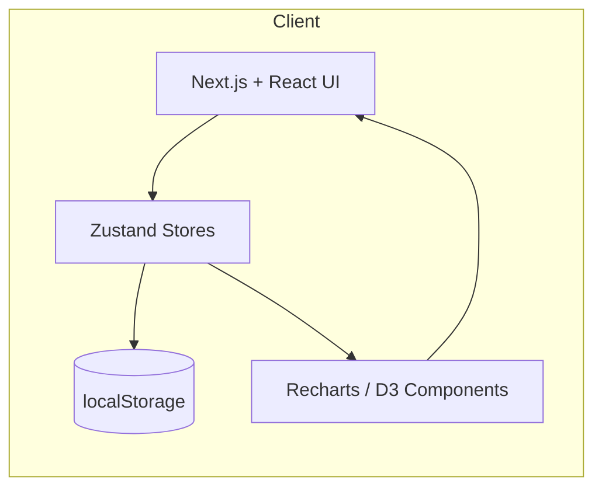
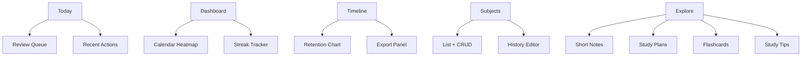
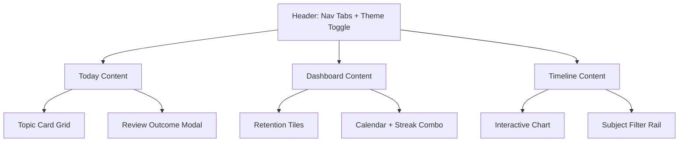

# Spaced Repetition App Documentation

## 1. Overview
- **App name:** Spaced Repetition App – "Remember more with adaptive review."
- **Tagline:** Adaptive study guidance for long-term mastery.
- **Summary:** An adaptive spaced-repetition learning system with memory tracking, visual analytics, and customizable study schedules.
- **Key goals:**
  - **Efficiency:** Prioritize the most impactful topics and minimize redundant reviews.
  - **Retention:** Model human forgetting and reinforce topics before predicted decay crosses the learner-defined threshold.
  - **Personalization:** Respect subject metadata, learner schedules, and difficulty feedback while keeping data local-first.
- **Current platform:** Responsive web experience delivered via Next.js 14 (App Router) with offline-friendly persistence.
- **Target platform:** Native or hybrid mobile clients (iOS, Android) reusing the adaptive scheduling logic and timeline visualizations.
- **Tech stack summary:**
  - Next.js 14, React 18, and TypeScript for the application shell and component logic.
  - Tailwind CSS (with design tokens for light/dark palettes) and Framer Motion microinteractions.
  - Zustand stores with localStorage persistence for topics, subjects, preferences, and timeline state.
  - Recharts + D3 utilities for retention curves, calendar heatmaps, and exportable charts.
  - Radix UI primitives, Lucide icons, and custom hooks for focus, keyboard handling, and analytics.

## 2. Navigation & Routes
- **Current navigation bar:** `Today | Dashboard | Timeline | Subjects | Explore`
- **Route purposes:**
  - **Today:** Presents the adaptive review queue in batches of five topics, emphasizing due-now cards with revise/skip actions and quality prompts.
  - **Dashboard:** Aggregates retention statistics, streaks, calendar integration, and a unified "Progress today" section.
  - **Timeline:** Offers visual retention curves with zoom/pan/export, toggling between combined or per-subject views.
  - **Subjects:** Provides CRUD management for subjects, including icon/color pickers, exam dates, and topic history editing.
  - **Explore:** Surfaces shared notes, study plans, flashcards, and curated study tips from the community.
- **Mobile adaptation suggestion:** Move the five primary routes into a bottom tab bar, pair with a floating action button for quick-add actions, and expose auxiliary pages (Settings, Calendar, Reviews) through a collapsible drawer or modal menu.

| Route | Core purpose | Key UI elements | Mobile considerations |
| --- | --- | --- | --- |
| `/today` | Adaptive queue | Topic cards, action prompts, review outcomes modal | Stack cards vertically with swipe gestures; lazy-load batches. |
| `/dashboard` | Progress summary | Calendar heatmap, streak tracker, retention tiles | Collapse widgets into accordions; pin streak badge. |
| `/timeline` | Retention analytics | Interactive line charts, export toolbar | Default to single-subject view, offer pinch-to-zoom. |
| `/subjects` | Subject admin | Icon/color pickers, exam date editor, history log | Use bottom sheets for forms; include search. |
| `/explore` | Shared resources | Notes list, plan importer, flashcard gallery | Provide segmented control for subsections; offline cache. |

## 3. Core Features & Logic
### a. Adaptive Review Algorithm
- Built around the exponential forgetting curve \(R(t) = f + (1 - f) e^{-t/s}\) with a configurable retention floor and learner-defined trigger (30–80%).
- **Retention trigger:** When predicted retention drops below the configured threshold, the topic enters the due queue.
- **Review cycle:** After each successful review, retention resets to 100%, stability increases, and the next interval lengthens.
- **Scheduling pseudocode:**

```ts
function scheduleNextReview(topic: Topic, quality: "easy" | "normal" | "hard", trigger = profile.retentionTrigger) {
  const elapsedDays = daysBetween(topic.lastReviewed, now());
  const retentionNow = computeRetrievability(topic.stability, elapsedDays, profile.retentionFloor);

  if (retentionNow <= trigger) {
    const adjustedStability = updateStability({
      stability: topic.stability,
      elapsedDays,
      quality,
      difficulty: topic.difficulty,
    });

    const intervalDays = Math.max(0.01, -adjustedStability * Math.log(trigger));

    return {
      nextReview: addDays(now(), intervalDays),
      stability: adjustedStability,
      retention: 1, // reset to 100%
    };
  }

  // Not yet due: keep existing schedule.
  return {
    nextReview: topic.nextReview,
    stability: topic.stability,
    retention: retentionNow,
  };
}
```

### b. Study Day ("Today" Tab)
- Shows five topics at a time; "Load more" fetches the next batch sorted by risk score (overdue > due today > upcoming).
- **Topic card layout:**
  - Title and subject badge (color + icon).
  - Predicted retention % and difficulty label (Easy/Normal/Hard).
  - Actions: **Revise** (primary), **Skip** (only for due-today cards), **Open details** (secondary link).
- **Action flow:**
  1. Learner selects Revise or Skip.
  2. System prompts "Was this EASY / NORMAL / HARD?"
  3. Quality response feeds the scheduler: Easy increases stability multiplier, Hard reduces it, Normal maintains baseline.
  4. Store logs a Review event and recalculates dashboard/timeline summaries.

### c. Retention Scoring
- **Forgetting curve:** \(R(t) = f + (1 - f) e^{-t/s}\), where \(f=0.2\) by default and \(s\) is topic stability.
- **Risk score components:** forgetting risk (1 - R(t)), overdue penalty, exam urgency, and difficulty bump.
- **Subject averages:** Per-subject retention aggregates topic retention via weighted mean (weight = topic stability). Example: Algebra 50%, Calculus 70%, Trigonometry 60% → Pure Mathematics averages 60%.
- **Visualization:** timeline overlays show retention dropoff, streak progress, and exam markers for quick triage.

## 4. Data Models
| Entity | Shape | Notes |
| --- | --- | --- |
| **Subject** | `{ id: string; name: string; color: string; icon: string; examDate?: string; topics: Topic[] }` | Color/icon cascade to topics; examDate drives urgency limits. |
| **Topic** | `{ id: string; name: string; subjectId: string; retention: number; lastReviewed: string; nextReview: string; difficulty: "easy" \| "normal" \| "hard" }` | Real implementation also tracks stability, events, and reminder preferences. |
| **Review** | `{ topicId: string; date: string; action: "revise" \| "skip"; difficultyResponse: "easy" \| "normal" \| "hard" }` | Stored per topic; informs schedule replay. |
| **Flashcard** | `{ id: string; subjectId: string; topic: string; question: string; answer: string; difficulty: "intro" \| "core" \| "challenge" }` | Optional attachments for Explore → Flashcards. |
| **StudyPlan** | `{ id: string; title: string; subjects: string[]; createdBy: string; isPublic: boolean }` | Supports import/export as JSON bundles. |
| **ShortNote** | `{ id: string; author: string; subject: string; topic: string; content: string; likes: number }` | Markdown content stored with reaction counts. |

## 5. Dashboard Logic
- **Calendar + Progress:** Daily review counts align with the learner’s timezone; cells show due, completed, and scheduled totals.
- **Retention overview:** Summaries by subject, e.g., Algebra 50%, Calculus 70%, Trigonometry 60%, rolling up to Pure Mathematics 60%.
- **Streak tracker:** Displays current streak, best streak, and motivational copy; resets obey local-day rules.
- **Next up & Progress today:** Combined panel featuring due-now chips, percent complete, and quick actions (start review, open subject).
- **Performance caching:** Metrics subscribe to memoized selectors to avoid re-computation when unrelated state changes.

## 6. Timeline View
- **Chart elements:** Retention curves, review markers (numbered badges), exam markers (subject-colored dotted lines), event dots, and opacity fades for de-emphasized curves.
- **View toggles:** "Combined" (all subjects stacked) or "Per Subject" (small multiples); mobile defaults to single subject for clarity.
- **Interactions:**
  - Hover tooltips reveal retention %, streak depth, and date.
  - Click isolates a curve; a "Back" button restores the full set.
  - Drag-to-zoom, scroll wheel scaling, keyboard shortcuts (`+`, `-`, `0`), and reset/back controls.
  - Export toolbar generates SVG/PNG with canvas tainting workaround (render chart to inline SVG before rasterizing).
- **Optimization:** Render one subject by default, lazily hydrate additional series, and apply opacity fade when >8 subjects are visible.
- **Render pipeline diagram:**

```mermaid
flowchart LR
  TopicsStore[Zustand Topics Store]
  PrefStore[Timeline Preferences]
  ProfileStore[Profile Store]
  TopicsStore --> Mapper[buildTimelineSeries()]
  PrefStore --> Mapper
  ProfileStore --> Mapper
  Mapper --> Chart[TimelineChart (Recharts + D3)]
  Chart --> Tooltip
  Chart --> Exporter
  Chart --> MiniTables[Subject Revision Tables]
```

## 7. Subjects Module
- **Creation/editing:** Modal or drawer with:
  - Icon picker using Lucide set; enforce unique icon per subject to improve recognition.
  - Single-color picker supporting hex/RGB with accessible previews.
  - Live preview card showing gradient background, soft shadow, icon scaling animation, and sample retention badge.
  - Optional exam date (ISO) to limit scheduling windows (e.g., no reviews after exam).
- **Additional actions:** bulk-import topics, edit history (backfill reviews), clone subject for new term.
- **Validation:** Prevent duplicate names (case-insensitive); warn if exam date precedes current schedule.

## 8. Explore Module
- **Short Notes:** Markdown-based notes with subject/topic filters and reactions.
- **Study Plans:** JSON bundles describing weekly schedules; users can share links or import into their library.
- **Flashcards:** Metadata plus study mode (shuffle, spaced). Each card references a topic to reuse retention metrics.
- **Study Tips:** Science-backed guidance (Pomodoro, retrieval practice, sleep hygiene, interleaving).
- **Sample dataset:**

```json
{
  "notes": [
    {
      "id": "note-algebra-01",
      "author": "Mira Patel",
      "subject": "Pure Mathematics",
      "topic": "Quadratic Transformations",
      "content": "Remember: completing the square reveals the vertex. Use it when graphing!",
      "likes": 18
    }
  ],
  "plans": [
    {
      "id": "plan-midterms",
      "title": "3-Week Midterm Ramp",
      "subjects": ["Algebra", "Calculus"],
      "createdBy": "StudyTeam",
      "isPublic": true
    }
  ],
  "flashcards": [
    {
      "id": "card-derivatives-01",
      "subjectId": "calc",
      "topic": "Derivative Basics",
      "question": "What is the derivative of sin(x)?",
      "answer": "cos(x)",
      "difficulty": "core"
    }
  ],
  "tips": [
    "Use 25-minute Pomodoro intervals and schedule reviews before the trigger hits.",
    "Sleep 7-9 hours to consolidate memories—avoid midnight cramming.",
    "Interleave subjects to reduce interference and improve recall.",
    "After reviewing, teach the topic aloud to reinforce retrieval pathways."
  ]
}
```

## 9. UI/UX Principles
- **Navigation style:** GitHub-inspired underline animation for active tabs; subtle hover scale + glow for inactive items.
- **Hover consistency:** Cards and icons scale to 1.02 with gradient highlight and maintain drop-shadow parity across themes.
- **Themes:** Synchronized light/dark palettes with high-contrast typography; theme persists in localStorage.
- **Accessibility:**
  - All interactive elements include ARIA labels or semantic roles.
  - Color contrast meets WCAG AA (checked via design tokens).
  - Keyboard navigation: tab order follows visual hierarchy; focus rings remain visible in both themes.
- **Mobile adjustments:**
  - Replace nav rail with bottom tabs and collapsible menu for secondary pages.
  - Transform horizontal card layouts into vertical stacks with swipe gestures for Revise/Skip.
  - Offer larger tap targets (minimum 48px) and haptic feedback for key actions.

## 10. Animations & Microinteractions
- Hover gradients on cards/icons implemented via Tailwind utility classes plus CSS variables.
- Button press scale (0.97) with quick rebound for tactile feel.
- Timeline curves animate between states using Framer Motion transitions keyed on subject IDs.
- Navigation underline slides smoothly between active tabs with spring easing.
- Subject preview icons update live while editing (scale pulse + color fade).

## 11. Future Enhancements
- AI-based study assistant that explains retention drops and auto-generates condensed notes.
- Mobile push notifications reminding learners of "Due Today" topics and upcoming exams.
- Cross-device sync via optional cloud backup (supabase / sync server) while retaining offline-first mode.
- Community leaderboard highlighting longest streaks and top-rated notes.
- Integrations with NotebookLM, Anki, and calendar providers for data import/export.

## 12. Diagram References
### System Architecture


### Review Scheduling Data Flow
```mermaid
digraph G {
  rankdir=LR;
  TopicEvent["Review Event"] -> Scheduler["updateStability & computeInterval"] -> Queue["Update nextReview"] -> Stores["Persist store snapshot"] -> UI["Refresh Today/Dashboard/Timeline"];
}
```

### Navigation Sitemap


### Example UI Wireframe Layout


## 13. Developer Notes
- **Folder structure:**
  - `src/app/` – App Router pages (`today`, `dashboard`, `timeline`, `subjects`, `explore`, plus settings and utilities).
  - `src/components/` – Shared UI components (e.g., `TopicCard`, `RetentionChart`, `SubjectPreview`, `TimelineToolbar`).
  - `src/stores/` – Zustand stores for topics, subjects, profile, appearance, and timeline preferences.
  - `src/lib/` – Pure utilities (`computeRetrievability`, `updateStability`, date helpers, analytics hooks).
  - `docs/` – Detailed architecture, data, UI, and testing references.
- **Naming conventions:** Use PascalCase for components, camelCase for hooks/utilities, kebab-case for file paths under routes.
- **Key components:**
  - `TopicCard` – Renders queue cards, handles revise/skip CTA, and launches quality prompt dialog.
  - `RetentionChart` – Wraps Recharts line chart, applies smoothing/opacity, and handles export actions.
  - `SubjectPreview` – Live preview card inside the subject editor with motion-enabled icon and color gradients.
- **Environment setup:**
  - `npm install`
  - `npm run dev`
  - Optional: `npm run lint`, `npm run test:visual`, `npm run test:curve` (validates scheduler math).
- **Build & deployment:** `npm run build` followed by `npm run start`; static export supported thanks to local-first persistence.
- **Recommended dependencies:** Next.js 14, React 18, TypeScript, Tailwind CSS, Zustand, Recharts, Radix UI, Lucide-react, Framer Motion, date-fns.
- **Testing guidance:**
  - Lint before committing.
  - Run curve tests after modifying scheduling utilities.
  - Use Playwright visual smoke tests to verify Today/Dashboard rendering.

