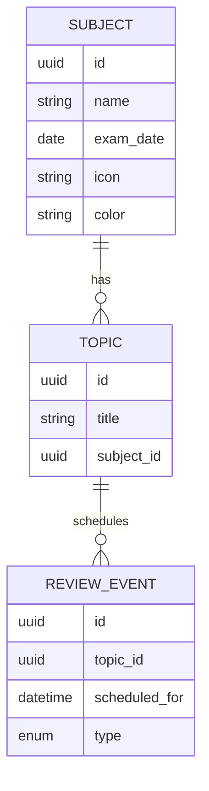
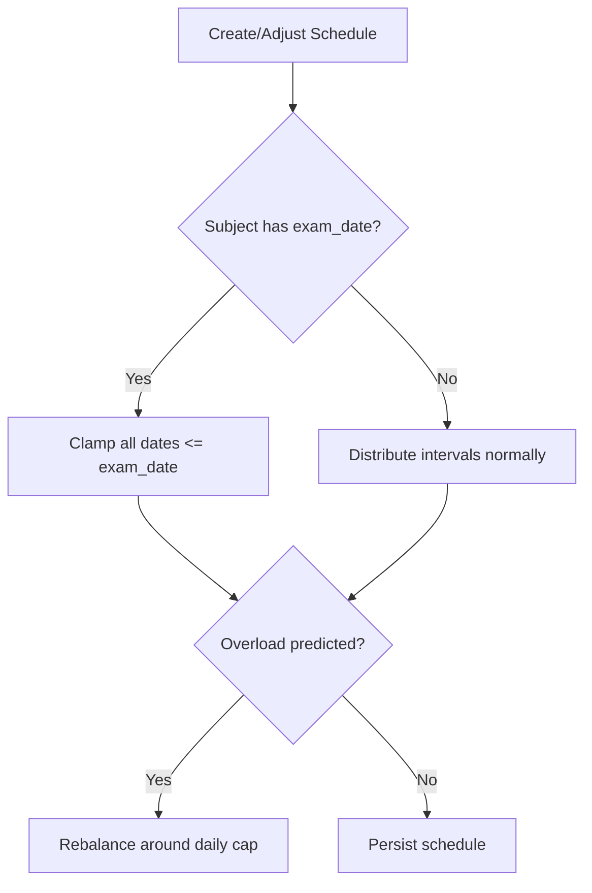
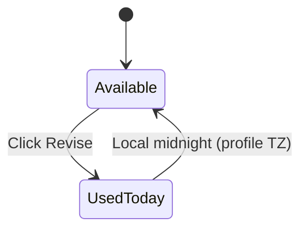
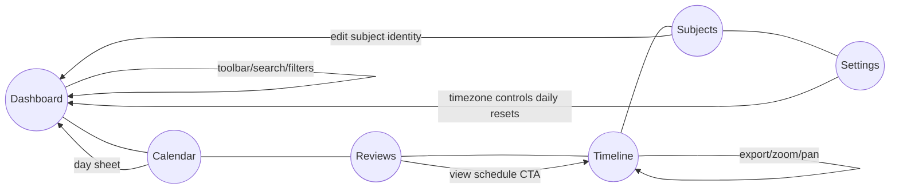

# Architecture Overview

## System context

The Spaced Repetition App is a local-first Next.js 14 application. All data is stored in the browser via Zustand's `localStorage` persistence, so the runtime consists solely of the Next.js server (during development) or static assets served by a CDN or Node.js server in production.

```
┌───────────┐        ┌────────────────────────┐
│  Browser  │  HTTP  │  Next.js app (App Dir) │
│ (React UI)├────────►│  Components & Routes   │
└─────┬─────┘        └──────────┬────────────┘
      │ localStorage            │ Zustand store
      │                         ▼
      └─────────────── Persisted topic state ──▶
```

## Domain model



Subjects own identity (icon/colour) and optional exam dates. Topics inherit that identity and store their interval history. Review events capture started/completed milestones and power the dashboard streaks.

## Key modules

- **App Router (`src/app`)** – Hosts dashboard, calendar, reviews, timeline, subjects, and settings pages. Each route uses the shared layout shell so navigation feels consistent.
- **UI components (`src/components`)** – Presentational and form components that render topic cards, subject summaries, day sheets, and settings controls.
- **State management (`src/stores/topics.ts`)** – A persisted Zustand store that encapsulates subjects, topics, and review metrics. It owns all mutations and enforces constraints (e.g., unique subject names, interval recalculation, exam date clamping, revise daily lockout).
- **Profile store (`src/stores/profile.ts`)** – Holds learner preferences (name, avatar colour, timezone). The timezone governs local-midnight logic throughout the UI.
- **Lib utilities (`src/lib`)** – Date helpers, feature flags, and formatting utilities used across views.

## Scheduling & cutoff flow



Exam dates clamp future reviews so the timeline and calendar never extend past the subject’s exam. When clamping generates an overload, the store rebalances by redistributing intervals prior to persistence.

## Revise (daily) logic



The `markReviewed` action checks the learner’s timezone before logging a revision. If the topic has already been revised within the same local calendar day, the action is blocked and the UI surfaces the locked tooltip.

## Navigation map



Every primary tab shares persisted filters (especially the Subjects dropdown) so the learner never loses context when hopping between views.

## Data flow

1. User interactions dispatch actions to the Zustand stores (`useTopicStore`, `useProfileStore`).
2. Store mutations update in-memory state, recalculate intervals, and append review events.
3. Persist middleware serialises each store into `localStorage` (`spaced-repetition-store`, `spaced-repetition-profile`).
4. Components subscribe to slices of state and rerender automatically when the store changes.

## Deployment considerations

- The project targets modern evergreen browsers; no SSR-only APIs are used.
- Local persistence means deployments do not require a backing database, but users will lose data when clearing browser storage or switching devices.
- Feature flags in `src/lib/feature-flags.ts` can toggle experimental behaviours without code changes elsewhere.
