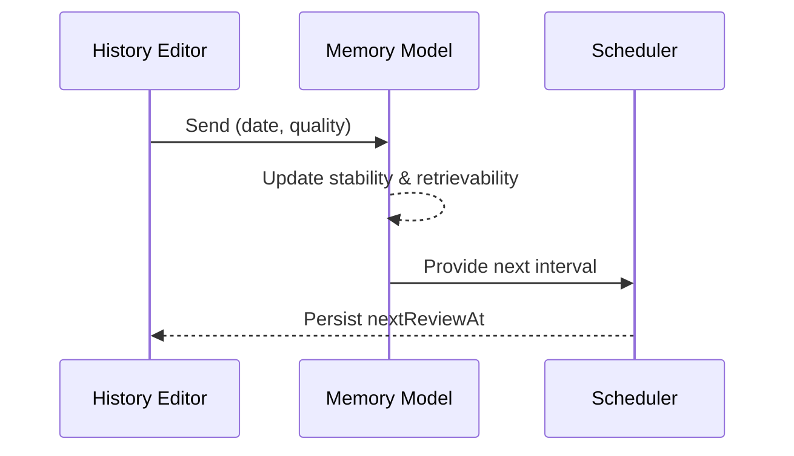

# ALGORITHMS_FORGETTING_CURVE

## Memory model

The app models memory using an exponential forgetting curve with a configurable retention floor.

\[ R(t) = f + (1 - f) \cdot e^{-t / s} \]

- **R(t)** – predicted retention after *t* days.
- **s** – topic stability in days.
- **f** – retention floor (defaults to 0.2 so mastery never falls below 20%).

`computeRetrievability` enforces minimum stability, clamps the retention floor, and returns a bounded value between the floor and 1.

## Interval selection

Learners choose a retention trigger **T** between 30% and 80%. Each time a topic is reviewed, the next interval is computed as:

\[ \Delta t = -s \cdot \ln(T) \]

`computeIntervalDays` ensures the interval never collapses below 15 minutes (0.01 days) even for unstable topics.

```mermaid
flowchart TD
  A[Review completed] --> B{Quality?}
  B -- 0 --> C[Apply lapse penalty]
  B -- 0.5 --> D[Partial success factors]
  B -- 1 --> E[Full success factors]
  C --> F[Clamp stability]
  D --> F
  E --> F
  F --> G[Compute interval = -s * ln(T)]
  G --> H[Schedule next review]
```

## Stability updates

`updateStability` adjusts the curve based on three forces:

1. **Spacing** – longer elapsed time increases stability via `log1p(elapsedDays)`.
2. **Streaks** – repeated correct reviews add multiplicative and additive bonuses.
3. **Lapses** – failures trigger a multiplicative penalty and clamp the result.

All updates are clamped between `STABILITY_MIN_DAYS` (0.25 days) and `STABILITY_MAX_DAYS` (10 years).

## Risk scoring

`computeRiskScore` powers the Today and Dashboard prioritisation queues. The score combines:

- **Forgetting risk** – `1 - retrievabilityNow` using current stability and elapsed time.
- **Overdue penalty** – increases after the scheduled due date passes.
- **Exam urgency** – pushes topics whose exam dates are near.
- **Difficulty bump** – considers average review quality and streak depth.

The function also returns the freshly computed interval so UI surfaces can show "Next review in X days" hints.

## Auto-skip detection

`autoSkipOverdueTopics` in the topic store walks every topic at load time. If predicted retention falls below the configured trigger and the due date is past due, the store moves the topic forward using the same interval logic. Notifications appear in the Today tab summarising how many cards were auto-skipped.

## History replay

When a learner backfills review history, the store replays events chronologically:



The replay path mirrors the live scheduler so the dashboard and timeline stay consistent.

[Back to Docs Index](../DOCS_INDEX.md)
