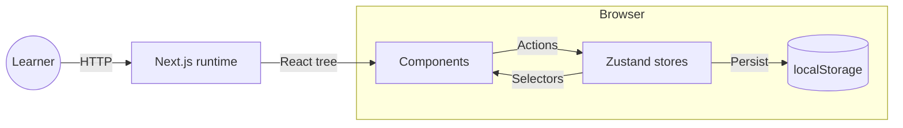
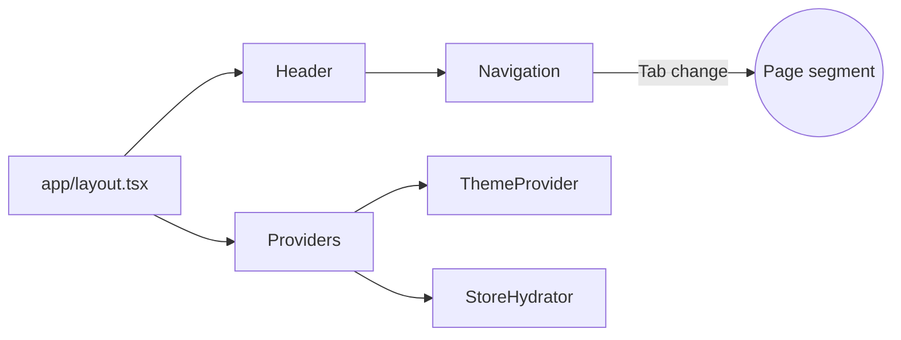
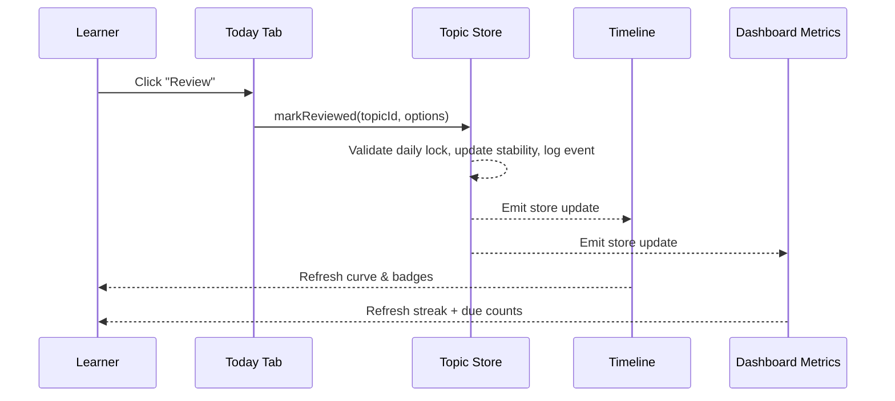

# ARCHITECTURE

## Overview

The Spaced Repetition App is a local-first Next.js 14 application. Pages are rendered with the App Router, and all study data is stored in the browser through Zustand persistence. No server-side database or API is required; the deployment can run as static assets with an optional Node.js server for incremental rendering.

## System context

- **Next.js runtime** serves the App Router shell, handles routing, and streams page payloads.
- **React components** render dashboards, timeline charts, forms, and dialogs.
- **Zustand stores** hold subjects, topics, preferences, and computed review projections.
- **`localStorage`** stores serialized snapshots of each store so the experience stays offline-first.

## Page shell

The app uses a persistent shell with a top navigation rail, tab-aware breadcrumbs, and shared layout metadata. Every route mounts beneath `src/app/layout.tsx`, which injects the global theme class, fonts, and analytics hooks.

- **Navigation** renders the Today, Dashboard, Timeline, and Subjects tabs, while Settings lives in the profile menu dropdown.
- **ThemeProvider** reads persisted theme preference and toggles the root class.
- **StoreHydrator** rehydrates persisted topics, profile, appearance, and timeline preferences before child routes render.

## Interaction loop

User input flows through React components and Zustand stores. The sequence below captures a typical review flow originating from the Today tab.

## Data synchronisation

- Stores use selectors inside components to subscribe to only the slices they need.
- Computed selectors derive summaries (e.g., per-subject review counts) to avoid recomputation in the React tree.
- A shared `useEffect` in `layout.tsx` watches for hydration completion so charts defer rendering until state is ready, preventing mismatches between SSR and CSR payloads.

## Error resilience

- Each major route wraps content in Suspense boundaries with skeleton placeholders.
- Timeline and dashboard widgets guard against missing data by checking hydration flags and fallback data seeded from `demo-seed-data.json`.
- The Settings page exposes switches for clearing demo data, reapplying smoothing, and resetting preferences when persistence breaks.

## Deployment considerations

- The application can ship as static HTML/JS; persistence keeps data local.
- Production builds rely on tree-shaken modules and route-level code splitting so less-used pages (Subjects, Settings) only load on demand.
- The `npm run build` command generates an optimized bundle with `next build`; use `npm run lint` and `npm run test:visual` before release.

[Back to Docs Index](../DOCS_INDEX.md)
