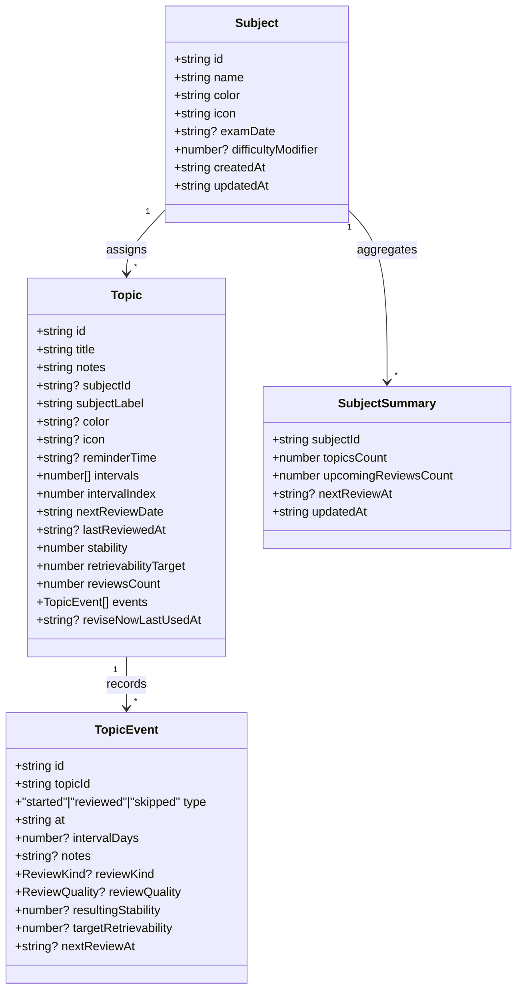

# DATA_MODEL

## Entities

## Storage layout

| Store key | Purpose | Shape |
| --- | --- | --- |
| `spaced-repetition-store` | Persists topics, subjects, legacy categories, and revise-now metrics. | `{ topics: Topic[]; subjects: Subject[]; categories: LegacyCategory[]; reviseNowMetrics: ReviseNowMetrics; }` |
| `spaced-repetition-profile` | Saves learner identity, timezone, retention trigger, and streak stats. | `{ name: string; avatarColor: string; timeZone: string; retentionTrigger: number; dailyLimit: number; }` |
| `spaced-repetition-theme` | Remembers light/dark mode. | `{ theme: "light" | "dark" }` |
| `spaced-repetition-appearance` | Keeps chart density, timeline opacity, and motion preferences. | `{ density: "cozy" | "comfortable"; transitions: boolean; charts: { lineSmoothing: number; showBadges: boolean; }; }` |

All keys are versioned implicitly by structure. When breaking changes ship, add a new key suffix, hydrate from existing data if available, then delete the legacy key.

## Derived metrics

- **Risk score** – Derived via `computeRiskScore` and cached alongside each topic. Higher scores bubble to the top of Today.
- **Upcoming review buckets** – Grouped by due date (overdue, due today, upcoming) for Today and Dashboard summary cards.
- **Subject summaries** – `getSubjectSummaries` calculates counts and next review dates, feeding the Subjects list and timeline mini tables.

## Constraints

- Subject names are unique case-insensitively; duplicates return an error message in the Subjects form.
- Topics inherit subject colour/icon automatically unless overridden when editing.
- Only one review per topic per local day is allowed. `markReviewed` checks the learner’s timezone boundary using `getDayKeyInTimeZone`.
- Review history backfills deduplicate events per day before re-running the scheduler.

[Back to Docs Index](../DOCS_INDEX.md)
