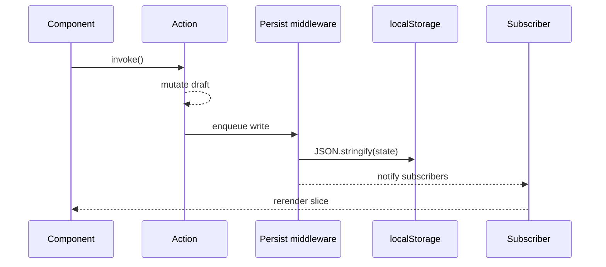

# STATE_MANAGEMENT

## Stores overview

| Store | File | Persistence key | Responsibilities |
| --- | --- | --- | --- |
| `useTopicStore` | `src/stores/topics.ts` | `spaced-repetition-store` | CRUD for subjects/topics, review scheduling, revise-now metrics, history replay, auto-skip. |
| `useTodayStore` | `src/stores/today.ts` | ephemeral | Tracks selected filters (status, subject, difficulty) and surface preferences for the Today view. |
| `useTimelinePreferencesStore` | `src/stores/timeline-preferences.ts` | `spaced-repetition-appearance` (shared) | Saves chart toggles (badges, opacity fade, fullscreen) and smoothing. |
| `useProfileStore` | `src/stores/profile.ts` | `spaced-repetition-profile` | Learner identity, timezone, retention trigger, daily review limit, streak counters. |
| `useThemeStore` | `src/stores/theme.ts` | `spaced-repetition-theme` | Light/dark toggle and system preference detection. |
| `useAppearanceStore` | `src/stores/appearance.ts` | `spaced-repetition-appearance` | Controls density, transitions, and global motion preferences. |
| `useReviewPreferencesStore` | `src/stores/review-preferences.ts` | `spaced-repetition-profile` (slice) | Stores reviewer defaults like enableAutoAdvance and audio cues. |

## Hydration strategy

All persisted stores use `persist` middleware. `app/layout.tsx` renders a `ClientHydrationGate` that waits for hydration before mounting interactive charts. Components should guard against `!isHydrated` before reading persisted fields to avoid SSR mismatches.

## Action design

- All mutations live inside the relevant store. Components call actions such as `addTopic`, `markReviewed`, or `setRetentionTrigger` via the exported hook.
- Actions return meaningful booleans or payloads so calling components can surface toasts (e.g., `markReviewed` returns `false` when the daily lock fails).
- Each action accepts optional parameters for timezone overrides and history adjustments to keep the API deterministic during tests.

## Selector usage

```tsx
const { dueToday, overdue } = useTopicStore(
  useCallback(
    (state) => ({
      dueToday: state.topics.filter((topic) => isDueToday(topic, tz)),
      overdue: state.topics.filter((topic) => isOverdue(topic, now)),
    }),
    [tz, now]
  )
);
```

Selectors should be memoised with `useCallback` when deriving arrays. Avoid selecting entire objects when only a few properties are needed; this keeps React renders predictable.

## Event timeline



## Undo & resets

- `useTopicStore` exposes `resetDemoData` and `clearAll` for quick resets from the Settings page.
- `useThemeStore` respects OS preference when the learner chooses "System" mode.
- `useProfileStore` clears streak history automatically if the retention trigger or daily limit changes drastically.

[Back to Docs Index](../DOCS_INDEX.md)
