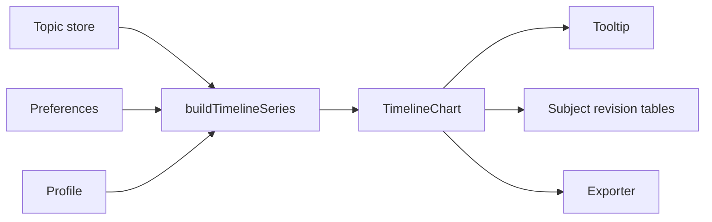

# TIMELINE

## Purpose

The Timeline visualises retention curves across all subjects. Learners can switch between Combined and Per subject layouts, zoom into ranges, and export PNG/SVG snapshots for revision planning.

## Data sources

- **Topic store** – Supplies stability, next review date, and review history for every topic.
- **Timeline preferences store** – Persists toggles for badges, opacity fade, subject filters, and fullscreen mode.
- **Profile store** – Provides timezone and retention trigger to align the Today line and risk shading.

## Render pipeline

1. `buildTimelineSeries` transforms topics into series grouped by subject.
2. The chart renders with D3 line generators inside a `useEffect` hook once hydration is complete.
3. Hover and focus events highlight individual curves, while `opacityFade` dims unselected series.

## Interaction controls

| Control | Location | Behaviour |
| --- | --- | --- |
| View toggle | Toolbar | Switches between Combined and Per subject layouts. Stores preference per session. |
| Subject filter | Toolbar | Limits visible subjects; Combined view shows a popover, Per subject view uses a chip rail. |
| Topic focus rail | Chart header | Clicking a topic chip isolates its curve. A **Back to subject** button restores the subject view. |
| Zoom | Chart canvas | Drag to select, scroll wheel adjusts scale, keyboard `+` / `-` / `0` provide shortcuts. |
| Reset & Back | Toolbar | Reset clears zoom stack; Back steps one zoom level. |
| Export | Toolbar | Downloads PNG or SVG with applied filters, exam markers, and Today line. |
| Fullscreen | Toolbar | Expands chart in a modal while preserving zoom and filters. |

## Badges and overlays

- **Today line** – Drawn at local midnight boundary using the profile timezone.
- **Exam markers** – Vertical dotted lines tinted with the subject colour. Toggle from the toolbar.
- **Review badges** – Render as numbered pills below the chart showing past review dates.
- **Risk shading** – Light gradient that darkens as predicted retention approaches the trigger.

## Performance notes

- Data is memoised via `useMemo` keyed on topics and preferences to avoid recalculating series on every render.
- Heavy D3 computations run in a `requestAnimationFrame` tick when zooming to keep pointer tracking smooth.
- When >8 subjects are selected the chart automatically enables opacity fading to prevent clutter.

## Upcoming enhancements

- **AI Help overlays** – Planned to annotate curves with natural-language explanations of risk spikes.
- **Template snapshots** – Roadmap item to export preset time windows (7, 14, 30 days) with branded chrome.

[Back to Docs Index](../DOCS_INDEX.md)
