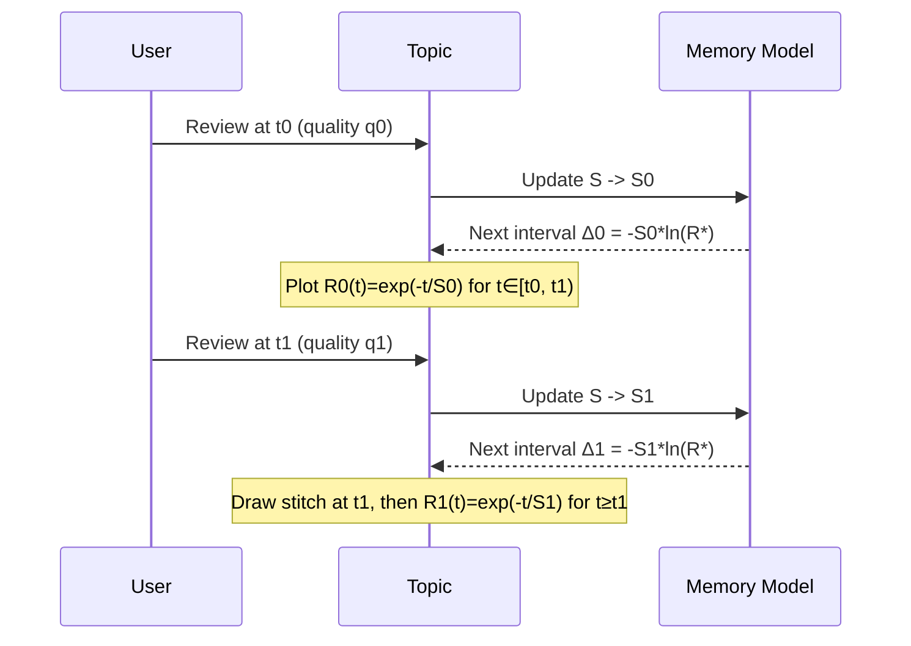
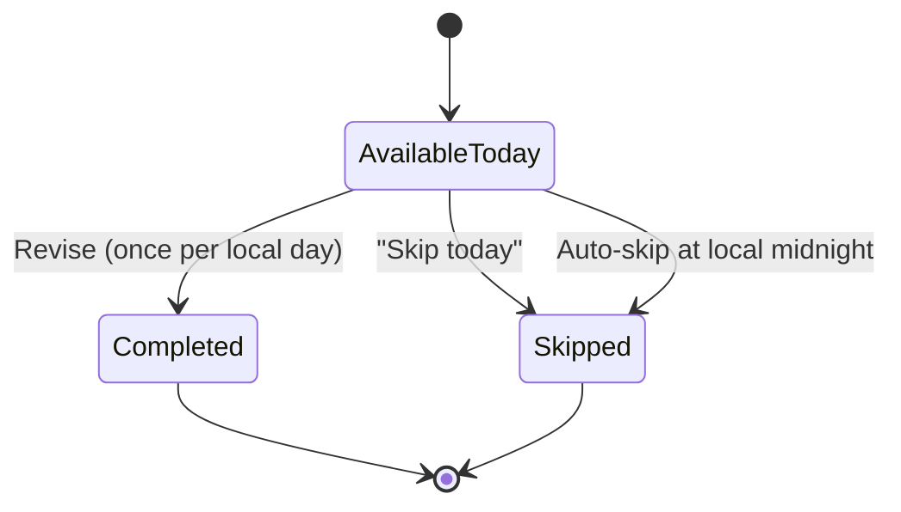

# Forgetting Curve Scheduling Model

Our scheduler uses an explicit exponential forgetting curve to determine when each topic should be reviewed.

## Retention model

- **Retrievability** (probability of recalling a topic without help) decays as `R(t) = e^{-(t / S)}` where:
  - `t` is the elapsed time since the last review (in days).
  - `S` is the topic’s current *stability* in days.
- We schedule the next review when `R(t)` is predicted to hit a configurable target `R*` (default `0.7`).
  - The interval in days is `Δ = -S · ln(R*)`.
  - Example intervals with `R* = 0.7`:
    - `S = 1.0` → `Δ ≈ 0.3567` days (≈ 8.6 hours).
    - `S = 2.0` → `Δ ≈ 0.7133` days (≈ 17.1 hours).
    - `S = 5.0` → `Δ ≈ 1.7834` days (≈ 42.8 hours).
  - With `R* = 0.8`, `S = 2.0` → `Δ ≈ 0.4463` days (≈ 10.7 hours).
  - With `R* = 0.6`, `S = 1.0` → `Δ ≈ 0.5108` days (≈ 12.3 hours).
- After each review we adjust stability using the scored quality `q ∈ {0, 0.5, 1}`:
  - `S_new = clamp(S_old · (1 + α · (q − 0.5)), S_min, S_max)`.
  - Defaults: `α = 1`, `S_min = 0.25d`, `S_max = 3650d`.
- Subject difficulty modifiers scale the stability (`S_eff = S · d`) with `d ∈ [0.5, 1.5]` before interval calculation.
- All scheduling happens in UTC timestamps but “today” boundaries use the learner’s profile timezone (Asia/Colombo by default).

We persist each review interval as a piecewise exponential segment. Historic segments remain visible (faded) while the active segment renders in full colour. When a review happens we stitch the curve vertically back to ~100% so the timeline shows a continuous story: previous decay → the pre-review retention → the reset and next decay.

```mermaid
flowchart TD
  A[After review -> update stability S] --> B[Compute Δ = -S ln(R*)]
  B --> C{Exam date set?}
  C -- Yes --> D[Clamp next review ≤ exam]
  C -- No --> E[Use computed interval]
  D --> F[Load smoothing (shift ±1–2 days if heavy)]
  E --> F[Load smoothing (shift ±1–2 days if heavy)]
  F --> G[Persist next_review_at, redraw timeline]
```



## Stored data

| Entity | Fields used by the scheduler |
| --- | --- |
| **Topic** | `stability`, `retrievabilityTarget`, `lastReviewedAt`, `nextReviewDate`, `reviewsCount`, `subjectDifficultyModifier`, `events[]` |
| **Event (review)** | `at`, `reviewQuality`, `reviewKind`, `resultingStability`, `targetRetrievability`, `nextReviewAt`, `intervalDays` |
| **Event (skip)** | `at`, `reviewKind`, `nextReviewAt` |
| **Subject** | `examDate`, `difficultyModifier`, `color`, `icon` |

Events capture the full review history so the timeline can plot the retention curve and show checkpoints. The live timeline marker re-computes `R(t)` every minute and surfaces the projected “zero-retention” horizon (`t_zero ≈ S · ln(100)`) — i.e. when retrievability would drift below 1% if the learner stopped reviewing entirely.

## Risk scoring (daily ordering)

Topics are prioritised by a blended risk score:

```
score = 0.55·(1 − R_now) + 0.25·overdue + 0.15·exam + 0.05·difficulty
```

- `R_now` is the current retrievability (`e^{-(Δt/S_eff)}`) where `Δt` is the age of the memory.
- `overdue = min(1, overdue_days / 3)` penalises late items.
- `exam = min(1, 1 / max(1, days_to_exam))` nudges subjects with imminent exams.
- `difficulty` adds 0.15 when recent quality scores fall below 0.75 and +0.05 for the first three reviews.

Sorting the home list by this score makes overdue or shaky memories float to the top while safe items drift down.

## Interval growth sanity

Successful recalls increase stability and therefore stretch the next interval (`Δ = -S ln(R*)`). Consecutive correct answers produce a monotone sequence (`t₂ > t₁ > t₀`) unless capped by an exam date or load smoothing. We persist every review’s `intervalDays` so QA can verify this “intervals grow” trend matches classic SRS algorithms such as SM-2 (intervals multiply by an easiness factor after good recalls) and modern FSRS variants.

```mermaid
graph LR
  I0[Interval t₁] --> I1[Interval t₂]
  I1 --> I2[Interval t₃]
  note right of I2: Correct recalls ⇒ S↑ ⇒ Δ↑ ⇒ t₂ > t₁ > t₀ on average
```

If a review fails (`q = 0`), stability drops immediately so the next interval shrinks before expanding again with later successes.

## Daily state machine

Topics can appear in Today’s plan at most once per local day. Manual or automatic skips push them forward while respecting exam dates.



## Smoothing & safeguards

- Load smoothing checks the daily cap (20 items by default) and nudges low-risk topics ±1–2 days while keeping exam constraints.
- Midnight auto-skip rolls unfinished items into the next light day and surfaces a banner summarising the move.
- Early reviews prompt whether to stretch future intervals or keep the original plan.

These rules ensure the timeline, calendar, and daily plan remain consistent with the forgetting-curve math while keeping the learner’s workload manageable.

## References

- Ebbinghaus-style exponential forgetting curve (retention / stability terminology) — [Wikipedia](https://en.wikipedia.org/wiki/Forgetting_curve)
- Spaced-repetition algorithms overview, including SM-2 and FSRS — [Wikipedia](https://en.wikipedia.org/wiki/Spaced_repetition)
- SM-2 classic schedule growth pattern (intervals 1, 6, then ×EF) — [Wikipedia](https://en.wikipedia.org/wiki/SuperMemo#Description)
