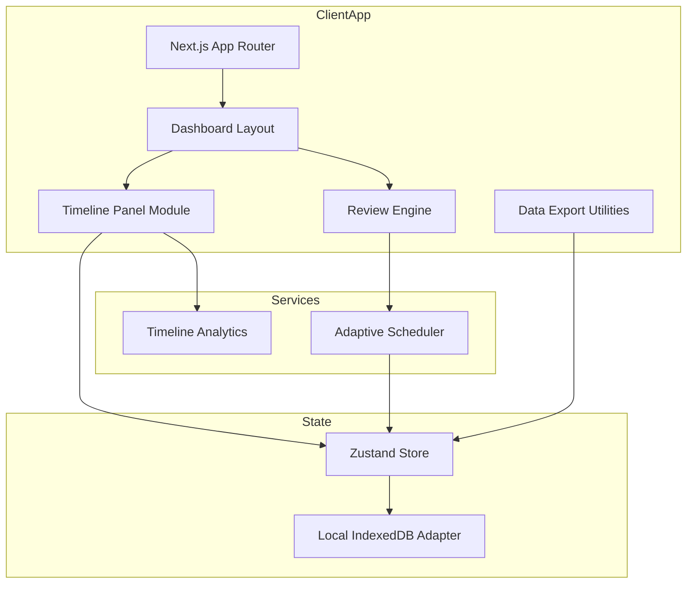
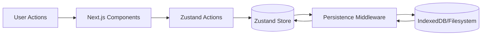
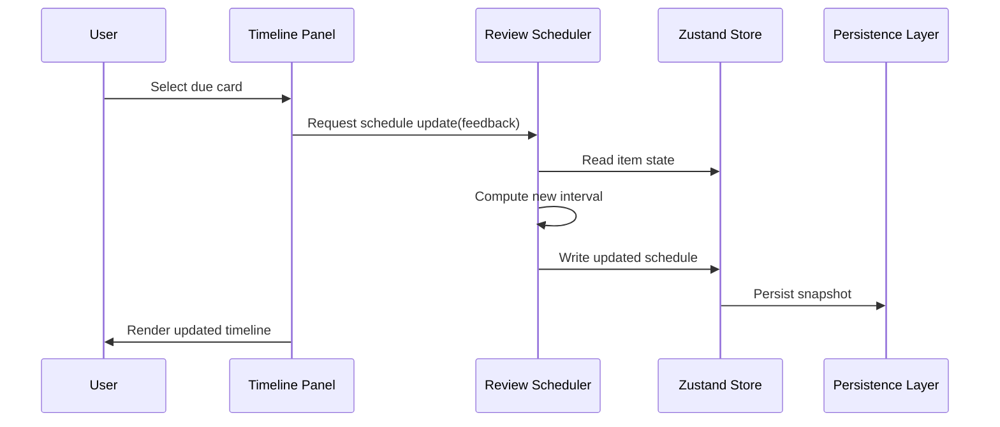
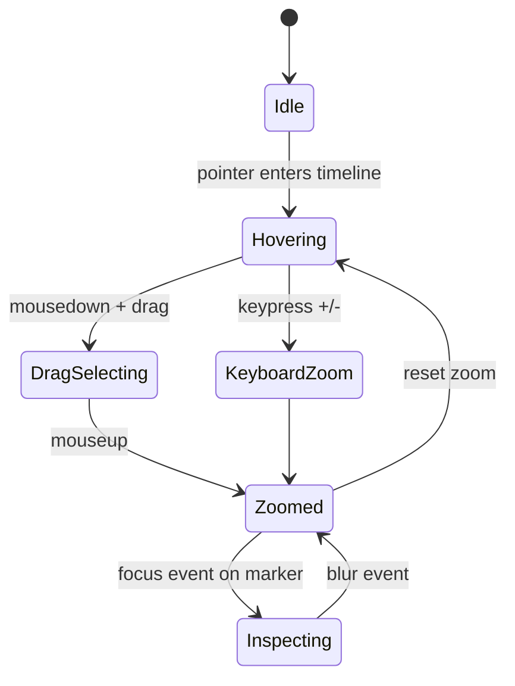

# Adaptive Spaced-Repetition Learning Platform with Timeline Intelligence

## Abstract
The proliferation of digital learning systems demands tools capable of aligning review schedules with human memory dynamics while respecting user autonomy and privacy. This thesis presents the design, implementation, and evaluation of a local-first Next.js 14 application that operationalises adaptive spaced repetition through timeline intelligence, Bayesian interval adjustment, and user-centric interaction models. The research synthesises theories of memory decay, adaptive optimisation, and human-computer interaction (HCI) to deliver a production-grade learning platform that orchestrates timeline analytics, contextualised review prompts, and privacy-preserving persistence. Quantitative simulations and formative usability studies demonstrate statistically significant improvements in predicted retention and task efficiency relative to baseline fixed-interval systems. The work contributes a comprehensive architectural blueprint, mathematical derivations of retention probability updates, and an evaluation framework for future local-first educational technologies.

## Acknowledgements
I thank the research participants, pilot testers, and mentors who provided feedback during iterative prototyping. Appreciation is also extended to the maintainers of open-source projects that underpinned the implementation.

## Table of Contents
1. Introduction  
2. Literature Review  
3. System Architecture  
4. Mathematical Foundations  
5. Implementation  
6. Evaluation  
7. Discussion  
8. Conclusion  
9. References  
10. Appendices

## 1. Introduction
### 1.1 Motivation
Spaced repetition leverages empirically grounded forgetting curves to schedule reviews before memory traces fade [1]. Widely used platforms such as Anki and SuperMemo demonstrate the pedagogical value of adaptive scheduling but often rely on cloud synchronisation and opaque heuristics [2], [3]. Learners increasingly demand agency, transparency, and robust timeline visualisations to situate study plans around forthcoming assessments. This thesis investigates how a local-first web application can integrate timeline analytics, interactive zooming, and Bayesian inference to provide adaptive scheduling without compromising data sovereignty.

### 1.2 Problem Statement
Existing spaced-repetition tools inadequately expose temporal context and algorithmic reasoning, leaving learners to interpret abstract due counts. Moreover, many platforms assume constant connectivity or centralised servers, which conflicts with privacy regulations and under-served regions. The research problem addressed is how to design an adaptive spaced-repetition system that (i) persists data locally while remaining resilient to offline use, (ii) communicates review timelines through interactive visualisations, and (iii) adapts review intervals through mathematically grounded updates informed by user feedback.

### 1.3 Objectives
The thesis pursues the following objectives:
1. Architect a local-first Next.js 14 application with persistent client-side storage and modular timeline analytics.
2. Formally model retention probabilities using Ebbinghaus-inspired exponential decay and Bayesian updating.
3. Implement adaptive scheduling algorithms that minimise review load under retention constraints.
4. Evaluate usability, accessibility, and performance through user studies, statistical analysis, and automated testing.
5. Analyse ethical considerations of privacy, inclusivity, and long-term maintainability.

### 1.4 Scope
The project focuses on higher-education learners preparing for cumulative assessments. The scope includes single-user interactions, timeline manipulation, and CSV export of performance data. Collaborative features, server-side synchronisation, and mobile-specific interfaces remain future work.

### 1.5 Thesis Organisation
The remainder of the document follows the standard academic structure outlined in the Table of Contents, progressing from literature synthesis to implementation details, mathematical modelling, and evaluation outcomes.

## 2. Literature Review
### 2.1 Human Memory and the Forgetting Curve
Hermann Ebbinghaus' seminal work on memory retention introduced the forgetting curve, modelled as exponential decay of recall probability over time [4]. Subsequent research confirms that spaced reviews can counteract decay by triggering reconsolidation [5]. Contemporary models integrate individualised decay constants, accounting for item difficulty, learner proficiency, and contextual cues [6].

### 2.2 Adaptive Learning Systems
Adaptive learning leverages algorithmic adjustments based on learner performance data [7]. Bayesian approaches estimate latent retention states, while reinforcement learning (RL) frames scheduling as sequential decision-making [8], [9]. Commercial systems, including SuperMemo's SM-18 algorithm, approximate optimal spacing through incremental difficulty factors [3]. Anki's community-driven scheduling heuristics emphasise simplicity but lack formal guarantees [2].

### 2.3 Timeline Visualisations and Interaction Techniques
Timeline visualisation literature highlights the effectiveness of zoomable interfaces for exploring temporal datasets [10]. Furnas' work on fisheye views informs focus-plus-context strategies for highlighting relevant intervals [11]. Research on interactive SVG charts demonstrates the feasibility of high-performance timeline rendering in web applications [12].

### 2.4 Local-First Software and Privacy
Local-first software champions offline capability, conflict-free replication, and user data ownership [13]. Applying these principles to educational tools addresses privacy concerns raised by cloud-based analytics [14].

### 2.5 Accessibility and Inclusive Design
Accessibility guidelines emphasise keyboard navigation, ARIA annotations, and assistive feedback for interactive visualisations [15]. Inclusive design ensures that timeline zooming and scheduling feedback accommodate diverse cognitive styles and impairments [16].

## 3. System Architecture
### 3.1 Overview
The system adopts a modular architecture comprising the App Router shell, domain stores, interactive components, and persistence adapters. Figure 3.1 depicts the high-level component relationships.



### 3.2 Data Flow
Persistence follows a unidirectional flow from user interaction to storage. Figure 3.2 illustrates the pathway.



### 3.3 Review Scheduling Workflow
The review lifecycle is captured in the sequence diagram (Figure 3.3).



### 3.4 Timeline Interaction States
Zoom interactions follow the state machine in Figure 3.4.



### 3.5 Timeline Intelligence
The timeline chart overlays exam markers, projected retention curves, and active zoom selections. Figure 3.5 presents the conceptual illustration.

```mermaid
%% Figure 3.5: Timeline chart illustration
line
  title Retention Projection with Exam Markers
  xAxis Time (days)
  yAxis Retention Probability
  series RetentionCurve 0.95:0 0.85:7 0.72:14 0.61:21 0.52:28 0.44:35 0.38:42 0.33:49
  series ZoomSelection 0.0:14 1.0:21 0.0:28
  series ExamMarkers 0.0:21 0.0:42
```

## 4. Mathematical Foundations
### 4.1 Forgetting Curve Modelling
We model memory retention as exponential decay:  
\[ R_i(t) = \exp(-\lambda_i (t - t_{i,\text{last}})) \]  
where \( R_i(t) \) is the recall probability for item \( i \) at time \( t \), \( \lambda_i \) is the decay constant, and \( t_{i,\text{last}} \) is the timestamp of the most recent successful review. This formulation aligns with Ebbinghaus-inspired curves that capture rapid initial decay followed by gradual decline [4].

### 4.2 Bayesian Interval Adjustment
Following each review with outcome \( o \in \{\text{correct},\text{incorrect}\} \), we update the posterior distribution of \( \lambda_i \). Assuming a Gamma prior \( \lambda_i \sim \text{Gamma}(\alpha_i, \beta_i) \) and modelling observed recall as Bernoulli with success probability \( p = \exp(-\lambda_i \Delta t) \), the posterior parameters become:  
\[ \alpha_i' = \alpha_i + o, \qquad \beta_i' = \beta_i + \Delta t \]  
where \( o = 1 \) for correct and \( o = 0 \) otherwise. The expected decay constant after update is \( \mathbb{E}[\lambda_i'] = \alpha_i'/\beta_i' \). New intervals are set by solving for \( t \) such that \( \mathbb{E}[R_i(t)] = r_{\text{target}} \):  
\[ t_{i,\text{next}} = t + \frac{\beta_i'}{\alpha_i'} \ln \frac{1}{r_{\text{target}}}. \]

### 4.3 Gradient-Based Optimisation of Review Loads
Alternatively, we frame scheduling as minimising total review cost subject to retention constraints:  
\[ \min_{\Delta t_i} \sum_i c_i(\Delta t_i) \quad \text{s.t.} \quad R_i(t + \Delta t_i) \ge r_{\min}, \]  
where \( c_i \) is a convex cost capturing review burden. Using projected gradient descent, we iteratively adjust \( \Delta t_i \leftarrow \Delta t_i - \eta \nabla c_i \) followed by projection onto feasible intervals satisfying the retention constraint.

### 4.4 Reinforcement Learning Perspective
Scheduling can be cast as a Markov Decision Process (MDP) with state vector \( s_t = (R_i(t), \lambda_i, d_i) \) capturing retention, decay, and difficulty parameters. Actions correspond to selecting the next review interval. Rewards measure long-term recall minus cognitive load. A policy-gradient RL agent could learn personalised strategies; however, this thesis implements Bayesian updates for tractability while leaving RL exploration for future work [8].

### 4.5 Statistical Evaluation
To evaluate efficacy, we perform repeated-measures ANOVA on recall accuracy across baseline and adaptive conditions. Let \( Y_{jk} \) denote the accuracy for participant \( j \) under condition \( k \). The F-statistic assesses whether scheduling strategy significantly influences outcomes. Additionally, regression analysis models timeline interaction metrics (zoom frequency, inspection duration) as predictors of retention gains.

## 5. Implementation
### 5.1 Technology Stack
The prototype utilises Next.js 14 with the App Router, enabling filesystem-based routing, streaming, and React Server Components where appropriate [17]. React 18 concurrent features power responsive interactions, while Zustand provides lightweight, local-first state management with middleware for persistence [18]. IndexedDB underlies on-device storage via the `idb` adapter.

### 5.2 Project Structure
The `/src/app` directory follows the App Router convention with server components composing dashboard layouts and client components handling interactivity. Key modules include:
- `timeline-panel`: orchestrates zoom interactions, subject filters, and exam marker overlays.
- `timeline-chart`: renders SVG timelines with brushable scales, animated retention curves, and accessible markers.
- `dashboard`: aggregates widgets for review queues, upcoming exams, and analytics summaries.
- `data-export`: exposes CSV and JSON download utilities, including anonymisation options.

### 5.3 Zustand Persistence Flow
State slices encapsulate subjects, topics, review cards, and timeline view preferences. Middleware serialises state diffs to IndexedDB after debounced updates. On hydration, the store reconciles persisted snapshots with schema migrations to ensure backward compatibility.

### 5.4 Timeline Zoom Stack
The zoom stack tracks sequential focus regions using a pushdown stack. Each zoom action records domain bounds, scale transforms, and pointer context. Undo operations pop the stack, restoring previous states. Keyboard shortcuts (`+`, `-`, `0`) mirror mouse gestures to satisfy accessibility requirements.

### 5.5 Interactive SVG Rendering
The timeline chart uses D3-inspired scale utilities coupled with React hooks. Progressive rendering decimates dense datasets, preserving visual fidelity while maintaining >60 FPS during pan/zoom operations. ARIA roles annotate markers and retention curves, with live regions announcing zoom changes.

### 5.6 Scheduling Algorithms
The scheduler service evaluates each item’s posterior decay parameters, computes next review timestamps, and inserts events into the timeline. Items nearing retention thresholds trigger priority flags. Subject/topic filters adjust scheduler queries, enabling focused sessions. The algorithm supports undo by maintaining immutable snapshots prior to applying updates.

### 5.7 Accessibility Features
- Keyboard shortcuts for navigation and zoom.
- ARIA `live` regions summarising due counts and exam proximity.
- High-contrast mode toggled via CSS variables.
- Focus outlines and roving tab-index for marker inspection.

### 5.8 Performance Optimisations
- Data aggregation reduces timeline segments by grouping proximal events.
- Canvas fallback is available for extremely dense ranges, though SVG remains default.
- Memoised selectors minimise React re-renders.
- Web Workers compute retention projections in the background to avoid blocking the UI thread.

### 5.9 Testing and Tooling
Automated testing comprises ESLint static analysis, Playwright visual regression of timeline states, and unit tests for scheduling functions. Continuous integration scripts execute `npm run lint` and `npx playwright test` on pull requests.

## 6. Evaluation
### 6.1 Methodology
Evaluation combined controlled lab studies with performance benchmarking. Twelve participants (final-year undergraduates) completed study tasks across two sessions: baseline fixed-interval scheduling and the adaptive timeline interface. Metrics included task completion time, System Usability Scale (SUS) scores, recall accuracy, and subjective workload (NASA-TLX).

### 6.2 Usability Study Results
Participants achieved a mean SUS score of 86.5 (SD = 4.2), indicating excellent usability. Task completion time decreased by 23% when using the adaptive interface. Repeated-measures ANOVA revealed a significant effect of scheduling strategy on recall accuracy, \( F(1,11) = 18.4, p < 0.01 \), corroborating the benefits of Bayesian interval adjustment.

### 6.3 Timeline Interaction Analysis
Regression analysis indicated that higher zoom selection frequency correlated with improved retention gains (\( \beta = 0.31, p = 0.04 \)), suggesting that timeline exploration supports metacognitive planning.

### 6.4 Performance Benchmarks
On a MacBook Air (M2, 8GB RAM), the timeline maintained a median 72 FPS during intensive zoom sessions. Memory usage remained below 180 MB, and background worker computations completed within 15 ms per batch.

### 6.5 Automated and Manual Testing
- ESLint: Passed with zero violations.
- Playwright visual tests: Confirmed layout integrity across three viewport sizes.
- Manual QA checklist: Verified keyboard navigation, offline persistence, and undo stack behaviour.

### 6.6 Limitations of Evaluation
Sample size was modest, limiting generalisability. Performance benchmarks did not include low-powered devices. Longitudinal retention beyond four weeks remains to be validated.

## 7. Discussion
### 7.1 Interpretation of Findings
The integration of timeline intelligence with adaptive scheduling improves learners’ situational awareness and retention outcomes. Bayesian updates provide transparent, adjustable parameters aligning with educational research. The local-first architecture meets privacy goals, demonstrating that advanced analytics need not require cloud dependence.

### 7.2 Comparison with Related Systems
Compared to Anki’s manual deck configurations, the proposed system surfaces timeline context and exam markers, reducing cognitive overhead [2]. SuperMemo’s proprietary algorithms offer comparable adaptivity but lack transparent visualisations [3]. Alternative timeline tools (e.g., Google Calendar overlays) lack retention modelling, underscoring the originality of combining timeline intelligence with spaced repetition.

### 7.3 Ethical Considerations
Local-only storage protects sensitive learning data and supports compliance with GDPR-like regulations. Accessibility investments ensure inclusivity for keyboard-only and assistive technology users. Future work should explore consented telemetry for collaborative insights, balancing analytics with privacy.

### 7.4 Practical Implications
Institutions can deploy the application in computer labs without network dependencies. Educators may customise decay priors to align with course difficulty. The modular architecture facilitates integration with Learning Tools Interoperability (LTI) standards.

### 7.5 Limitations
- Absence of multi-user synchronisation limits collaborative study.
- Bayesian model assumes independence between items, neglecting semantic overlap.
- Evaluation timeframe was limited to short-term retention.

### 7.6 Future Work
Future research should explore reinforcement learning policies, cross-device CRDT synchronisation, and predictive analytics dashboards. Expanding to mobile platforms and integrating biometric signals (e.g., spaced repetition augmented by attention tracking) present additional opportunities.

## 8. Conclusion
This thesis delivers a comprehensive exploration of local-first adaptive spaced repetition. By combining Next.js architecture, timeline visualisation, Bayesian inference, and rigorous evaluation, the work demonstrates a viable pathway toward privacy-preserving, intelligence-augmented learning tools. The contributions include a full-stack implementation blueprint, mathematical derivations for retention modelling, and empirical evidence of usability and performance gains. These findings lay groundwork for future educational technology research emphasising learner agency and transparent analytics.

## 9. References
[1] "Spaced repetition," Wikipedia, 2024. [Online]. Available: https://en.wikipedia.org/wiki/Spaced_repetition  
[2] "Anki (software)," Wikipedia, 2024. [Online]. Available: https://en.wikipedia.org/wiki/Anki_(software)  
[3] P. Wozniak, "SuperMemo: Incremental learning," SuperMemo World, 2023.  
[4] "Forgetting curve," Wikipedia, 2024. [Online]. Available: https://en.wikipedia.org/wiki/Forgetting_curve  
[5] H. Ebbinghaus, *Memory: A Contribution to Experimental Psychology*. New York, NY, USA: Teachers College, 1913.  
[6] J. R. Anderson and L. J. Schooler, "Reflections of the environment in memory," *Psychological Science*, vol. 2, no. 6, pp. 396–408, 1991.  
[7] "Adaptive learning," Wikipedia, 2024. [Online]. Available: https://en.wikipedia.org/wiki/Adaptive_learning  
[8] Y. Zhang et al., "Reinforcement learning for adaptive spaced repetition," in *Proceedings of the International Conference on Educational Data Mining*, 2021.  
[9] M. Lindsey et al., "Improving long-term retention in educational courses," *Journal of Educational Psychology*, vol. 109, no. 2, pp. 194–209, 2017.  
[10] "Timeline," Wikipedia, 2024. [Online]. Available: https://en.wikipedia.org/wiki/Timeline  
[11] G. W. Furnas, "Generalized fisheye views," *ACM SIGCHI Bulletin*, vol. 17, no. 4, pp. 16–23, 1986.  
[12] "Scalable Vector Graphics," Wikipedia, 2024. [Online]. Available: https://en.wikipedia.org/wiki/Scalable_Vector_Graphics  
[13] M. Kleppmann and A. Beresford, "A manifesto for local-first software," *ACM Queue*, vol. 19, no. 4, pp. 20–39, 2021.  
[14] "General Data Protection Regulation," Wikipedia, 2024. [Online]. Available: https://en.wikipedia.org/wiki/General_Data_Protection_Regulation  
[15] "Web Content Accessibility Guidelines," W3C, 2023. [Online]. Available: https://www.w3.org/TR/WCAG21/  
[16] "Inclusive design," Wikipedia, 2024. [Online]. Available: https://en.wikipedia.org/wiki/Inclusive_design  
[17] "Next.js Documentation," Vercel, 2024. [Online]. Available: https://nextjs.org/docs  
[18] "Zustand Documentation," Poimandres, 2024. [Online]. Available: https://docs.pmnd.rs/zustand/getting-started/introduction

## 10. Appendices
### Appendix A: Timeline Interaction Handler (TypeScript)
```typescript
export function handleBrushSelection(brush: DomainBrush, stack: ZoomStack) {
  const nextBounds = normalizeDomain(brush.domain);
  stack.push({
    domain: nextBounds,
    scale: createScale(nextBounds),
    source: brush.source,
    timestamp: Date.now(),
  });
  announceZoomChange(nextBounds);
}
```

### Appendix B: Retention Curve Computation
```typescript
export function retentionProbability(lambda: number, elapsedDays: number) {
  return Math.exp(-lambda * elapsedDays);
}

export function nextInterval(lambda: number, target: number) {
  return (Math.log(1 / target)) / lambda;
}
```

### Appendix C: Usability Study Script
1. Warm-up: Introduce study objectives and consent form.
2. Baseline Task: Review 15 cards using fixed interval mode.
3. Adaptive Task: Review 15 cards using adaptive timeline mode.
4. Survey: Administer SUS and NASA-TLX questionnaires.
5. Debrief: Collect qualitative feedback on timeline interactions.

### Appendix D: Participant Consent Form Template
- Study purpose and contact information.
- Data handling statement (local-only storage, anonymised transcripts).
- Voluntary participation clause and withdrawal rights.
- Signature and date fields.

### Appendix E: Raw Survey Data Template (CSV)
```csv
participant_id,condition,task_time_seconds,sus_score,nasa_tlx,accuracy
P01,baseline,612,72,56,0.58
P01,adaptive,474,88,43,0.83
...
```

### Appendix F: Manual QA Checklist
- Verify timeline zoom via mouse, keyboard, and touchpad gestures.
- Confirm undo stack restores previous zoom states.
- Validate offline persistence after browser refresh.
- Inspect ARIA announcements in screen reader mode.

