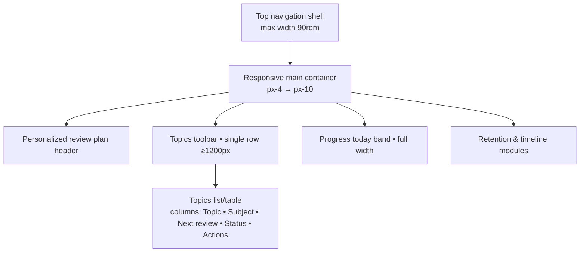
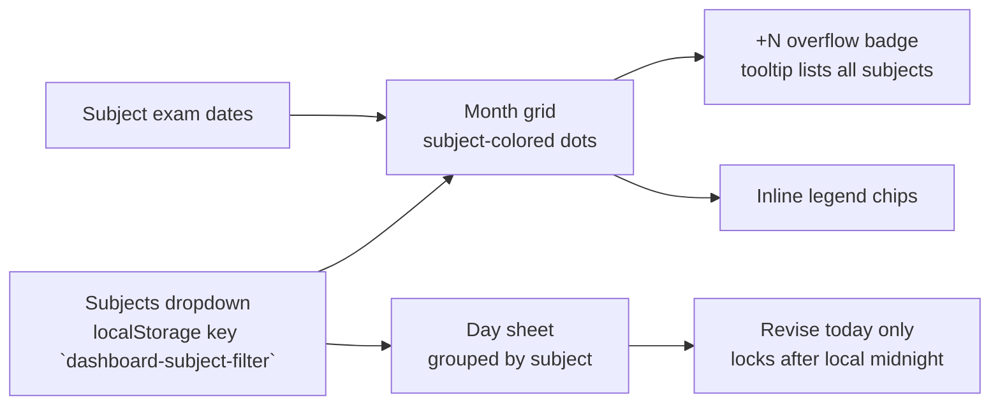
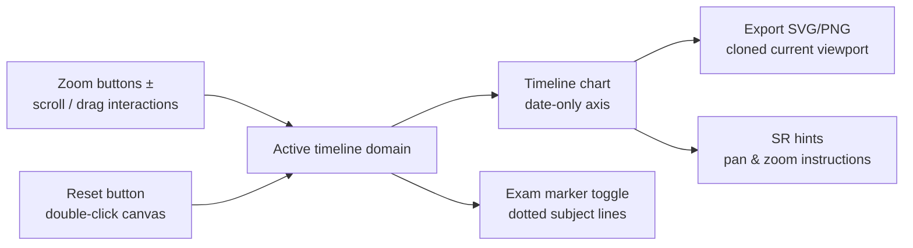

# Home Page UI Token Audit

## Layout Shell Overview



Breakpoints keep the toolbar on a single line at ≥1280px, allow one wrap on tablets, and collapse to stacked filters on mobile while search remains first and full-width.

### Dashboard toolbar interactions

```mermaid
flowchart LR
  Search[/Search input<br/>sessionStorage key `dashboard-topic-search`/] -- debounce 150ms --> Filter[Apply text filter]
  Filter --> Persist{Persist UI state}
  Status[Status chips<br/>sessionStorage key `dashboard-status-filter`] --> Persist
  Subjects[Subjects menu<br/>localStorage key `dashboard-subject-filter`] --> Persist
  Sort[Sort popover<br/>sessionStorage key `dashboard-topic-sort`] --> Persist
  Persist --> TopicList[Topic table rows<br/>Topic • Subject • Next review • Status • Actions]
  TopicList --> Summary[Results summary<br/>"Showing n of m topics"]
  Summary --> ClearFilters[Clear filters pill]
```

Search, filter, and sort preferences now persist between dashboard sessions using sessionStorage/localStorage, preventing layout shifts when navigating away and back.

### Calendar legend & day sheet



Calendar and dashboard now share the same persisted subjects filter, so toggling a subject in either view updates the other. Day sheets group topics by subject, exposing revise actions only for the current day and messaging future or locked entries.

### Timeline zoom, pan, and export



Zoom controls, drag panning, and shift-scroll translate into domain updates that feed the SVG timeline. Reset returns to the full domain, while exports clone the currently rendered SVG so the downloaded chart matches the on-screen viewport.

## Typography
- Primary page title (`Stay ahead of your reviews`): `text-3xl font-semibold` with `color: #ffffff` in dark mode / `#1a1a1a` in light mode.
- Section titles (e.g. `Scheduled Reviews`, empty state heading): `text-2xl`/`text-xl` with `font-semibold` and the same theme-specific colour pairing.
- Body copy: `text-sm leading-relaxed` with `color: #a0a0a0` (dark) or `#666666` (light).
- Meta/badge text: `text-xs uppercase` with `color: #808080` (dark) or `#999999` (light).

## Colors & Surfaces
- **Dark theme palette**: background `#0f1115`, primary surface `#181b20`, muted surface `#1b1e24`, border `#262a30`, accent `#3dea95`.
- **Light theme palette**: background `#ffffff`, primary surface `#f8f9fa`, muted surface `#f2f3f5`, border `#dcdcdc`, accent `#21ce99`.
- Surfaces are flat (no shadows); elevation is communicated solely through border contrast and spacing.
- Charts keep soft area gradients (`rgba(61, 234, 149, 0.25 → 0)` dark / `rgba(33, 206, 153, 0.2 → 0)` light) while UI panels remain solid fills.
- Text always pairs `textPrimary` against the background, while muted copy uses `#a0a0a0` (dark) or `#666666` (light).

## Spacing & Layout
- Page container: `max-w-[90rem]` with `px-4 md:px-6 lg:px-8 xl:px-10`, vertical rhythm via `gap-8`
- Section padding: compact hero band `px-6 py-6`, dashboard tiles `p-6`, progress band `px-8 py-8`
- Grid rhythm: `gap-6` as the baseline, responsive columns like `lg:grid-cols-[minmax(0,360px)_1fr]`, `md:grid-cols-2`, `xl:grid-cols-3`

## Buttons & Controls
- Primary CTA: accent border `#3dea95` (dark) or `#21ce99` (light) with matching text on the neutral surface—hover fills swap to the muted accent `#2d9467` / `#16a879`.
- Secondary actions: outline variant using the base border colour (`#262a30` dark / `#dcdcdc` light) with flat fills; hover states only adjust background tint.
- Ghost/icon actions: transparent background with icon colouring (`#666c72` dark / `#9aa0a6` light`) flipping to the accent on hover.
- Form controls: `rounded-lg border` with theme border colour on top of the surface fill; focus ring draws a 1px accent outline with no drop shadow.

## Card & Panel Treatments
- Containers use `rounded-3xl`, solid surfaces (`#181b20` dark / `#f8f9fa` light), and 1px borders (`#262a30` dark / `#dcdcdc` light).
- Empty states: dashed borders reuse the border colour, while icon tiles place the accent colour on a muted surface without gradients.

## Iconography
- Header icons: rely on accent text colour (`#3dea95` dark / `#21ce99` light) on top of flat surfaces—no background tint.
- Subject badges: subject accent fills the chip with a 12% opacity overlay in light mode and 18% in dark mode for contrast without shadows.
- Action icons: `h-4 w-4` within ghost buttons, shifting from `#666c72` or `#9aa0a6` to the accent colour on hover.
