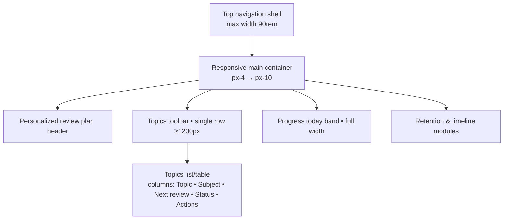
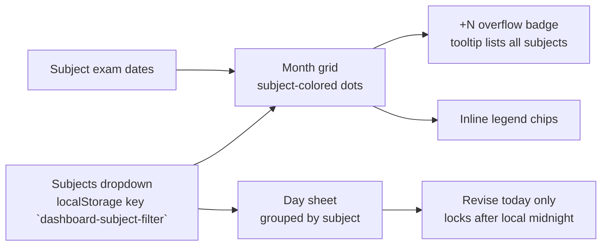
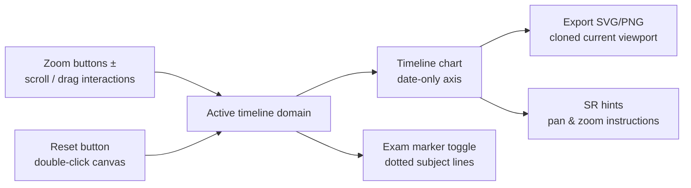

# Home Page UI Token Audit

## Layout Shell Overview



Breakpoints keep the toolbar on a single line at ≥1280px, allow one wrap on tablets, and collapse to stacked filters on mobile while search remains first and full-width.

### Dashboard toolbar interactions

```mermaid
flowchart LR
  Search[/Search input<br/>sessionStorage key `dashboard-topic-search`/] -- debounce 150ms --> Filter[Apply text filter]
  Filter --> Persist{Persist UI state}
  Status[Status chips<br/>sessionStorage key `dashboard-status-filter`] --> Persist
  Subjects[Subjects menu<br/>localStorage key `dashboard-subject-filter`] --> Persist
  Sort[Sort popover<br/>sessionStorage key `dashboard-topic-sort`] --> Persist
  Persist --> TopicList[Topic table rows<br/>Topic • Subject • Next review • Status • Actions]
  TopicList --> Summary[Results summary<br/>"Showing n of m topics"]
  Summary --> ClearFilters[Clear filters pill]
```

Search, filter, and sort preferences now persist between dashboard sessions using sessionStorage/localStorage, preventing layout shifts when navigating away and back.

### Calendar legend & day sheet



Calendar and dashboard now share the same persisted subjects filter, so toggling a subject in either view updates the other. Day sheets group topics by subject, exposing revise actions only for the current day and messaging future or locked entries.

### Timeline zoom, pan, and export



Zoom controls, drag panning, and shift-scroll translate into domain updates that feed the SVG timeline. Reset returns to the full domain, while exports clone the currently rendered SVG so the downloaded chart matches the on-screen viewport.

## Typography
- Primary page title (`Stay ahead of your reviews`): `text-3xl font-semibold text-white`
- Section titles (e.g. `Scheduled Reviews`, empty state heading): `text-2xl`/`text-xl` with `font-semibold text-white`
- Body copy: `text-sm` with `text-zinc-300` or `text-zinc-400`, often `leading-relaxed`
- Meta/badge text: `text-xs text-zinc-400`, uppercase for chips when needed

## Colors & Surfaces
- Accent brand: `bg-accent` (`#38bdf8`) with `text-accent-foreground`
- Panels: gradient surface `bg-gradient-to-br from-white/10 via-white/5 to-white/0`
- Secondary surfaces: `bg-white/5`, chips `bg-white/10`, muted backgrounds `bg-muted`
- Borders: `border border-white/5` on primary cards, `border-white/10` for subtle dividers or pills
- Text contrast: titles `text-white`, supporting copy `text-zinc-300`, meta text `text-zinc-400`

## Spacing & Layout
- Page container: `max-w-[90rem]` with `px-4 md:px-6 lg:px-8 xl:px-10`, vertical rhythm via `gap-8`
- Section padding: compact hero band `px-6 py-6`, dashboard tiles `p-6`, progress band `px-8 py-8`
- Grid rhythm: `gap-6` as the baseline, responsive columns like `lg:grid-cols-[minmax(0,360px)_1fr]`, `md:grid-cols-2`, `xl:grid-cols-3`

## Buttons & Controls
- Primary CTA: `Button` default variant (accent fill) with rounded-lg corners
- Secondary actions: `variant="outline"` (`border-border bg-surface hover:bg-muted`)
- Ghost/icon actions: `variant="ghost"` with subtle hover fill; icon buttons on the dashboard use `h-11 w-11` to keep touch targets ≥44px.
- Form controls: `rounded-lg border border-border bg-card/60 px-3 py-2 text-sm` and accent focus ring; the dashboard search input is elevated with `border-white/10 bg-slate-950/85` and includes quick-key hints.

## Card & Panel Treatments
- Containers use `rounded-3xl`, translucent surfaces (`bg-white/5`), soft borders (`border-white/5`), `shadow-lg`–`shadow-2xl`, and `backdrop-blur`
- Empty states: dashed borders `border-dashed border-white/10`, icon tiles `rounded-2xl bg-accent/20`

## Iconography
- Header icons: `rounded-2xl bg-accent/20 p-3 text-accent` with `h-6 w-6`
- Subject badges: inline pill uses subject colour tint (`${color}1f`) plus an `IconPreview` rendered at `h-3.5 w-3.5` on a `bg-white/15` disc for contrast.
- Action icons: `h-4 w-4` within ghost buttons, consistent spacing via `gap-2`
