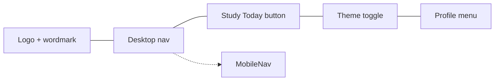

# NAVIGATION

## Primary tabs

| Order | Label | Icon | Route | Description |
| --- | --- | --- | --- | --- |
| 1 | Today | `CalendarCheck` | `/today` | Prioritised list of topics sorted by risk, includes revise-now actions and filters. Root route `/` redirects here. |
| 2 | Dashboard | `LayoutDashboard` | `/dashboard` | High-level analytics: streaks, review load, completion progress. |
| 3 | Timeline | `LineChart` | `/timeline` | Retention curves with zoom, subject filters, and exports. |
| 4 | Subjects | `BookOpen` | `/subjects` | Manage subject metadata, exam dates, and topic history. |
| 5 | Settings | `Settings` | `/settings` | Profile, theme, automation, and data management controls. |

## Header layout

- Desktop navigation sits inside a frosted glass container with rounded corners and accent outlines on the active item.
- Mobile shows a floating bottom nav with the same order; icons remain labelled until the viewport drops below 480px, then labels hide.

## Interaction states

- Hover: background tint (`accent/10` light, `accent/20` dark), icon scales to 110%.
- Active: accent background + border highlight with accessible text colour.
- Focus: uses the shared `focus-visible` outline at 2px accent.
- Notification pill: the **Study Today** button shows the number of due cards for quick access.

## Responsive logic

- The header is sticky with backdrop blur to keep tabs visible during long scrolls.
- On mobile, the nav compresses into the floating bar while the header collapses to logo + actions.
- All nav links route via Next.js `<Link>` to preserve client-side transitions.

## Future tabs

Planned additions will live inside the navigation menu once shipped:

- **AI Help** – contextual explanations for upcoming reviews.
- **Templates** – saved study plans for exam crunch periods.
- **Notifications** – aggregated reminders and exam countdowns.

[Back to Docs Index](../DOCS_INDEX.md)
