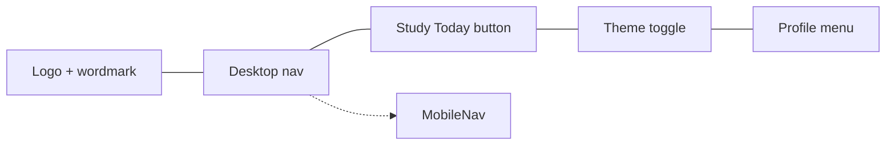

# NAVIGATION

## Primary tabs

| Order | Label | Icon | Route | Description |
| --- | --- | --- | --- | --- |
| 1 | Today | `CalendarCheck` | `/today` | Prioritised list of topics sorted by risk, includes revise-now actions and filters. Root route `/` redirects here. |
| 2 | Dashboard | `LayoutDashboard` | `/dashboard` | High-level analytics: streaks, review load, completion progress. |
| 3 | Timeline | `LineChart` | `/timeline` | Retention curves with zoom, subject filters, and exports. |
| 4 | Subjects | `BookOpen` | `/subjects` | Manage subject metadata, exam dates, and topic history. |
| 5 | Settings | `Settings` | `/settings` | Personalisation controls, notification rules, and integrations. |

All five tabs are centred within the header’s UnderlineNav component while secondary actions (theme toggle, notifications, profile) remain on the right.

## Header layout

- Desktop navigation uses a flat UnderlineNav container with subtle backdrop blur and a centred tab list. Each link renders a pseudo-element underline driven by Tailwind classes.
- Mobile switches to a Radix `Select` dropdown beneath the header so the same routes remain reachable with accessible labelling.

## Interaction states

- Hover: 150 ms delayed underline expansion from the centre, accent-tinted text, and icon scale to 105% with a soft background tint (`accent/10`).
- Active: 2px accent underline plus accent foreground text; highlight persists on focus via shared ring utilities.
- Focus: uses the shared `focus-visible` outline at 2px accent.
- Notification pill: the **Study Today** button shows the number of due cards for quick access.
- Today tab counter: displays the current due count beside the label in a GitHub-style pill for parity with notification badges.

## Responsive logic

- The header is sticky with backdrop blur to keep tabs visible during long scrolls.
- On mobile, the UnderlineNav collapses into the dropdown while the header keeps logo, theme toggle, notifications, and profile buttons inline.
- All nav links route via Next.js `<Link>` to preserve client-side transitions.

## Future tabs

Planned additions will live inside the navigation menu once shipped:

- **AI Help** – contextual explanations for upcoming reviews.
- **Templates** – saved study plans for exam crunch periods.
- **Notifications** – aggregated reminders and exam countdowns.

[Back to Docs Index](../DOCS_INDEX.md)
