# Mermaid Diagrams Overview

This document aggregates all Mermaid diagrams found in the documentation. Each diagram is grouped by source file with a brief contextual title.


---

## Source: `README.md`

### System Context

*Description*: Mermaid diagram extracted from README.md, diagram #1.

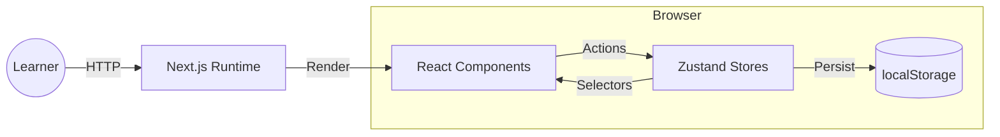

### Review Flow

*Description*: Mermaid diagram extracted from README.md, diagram #2.

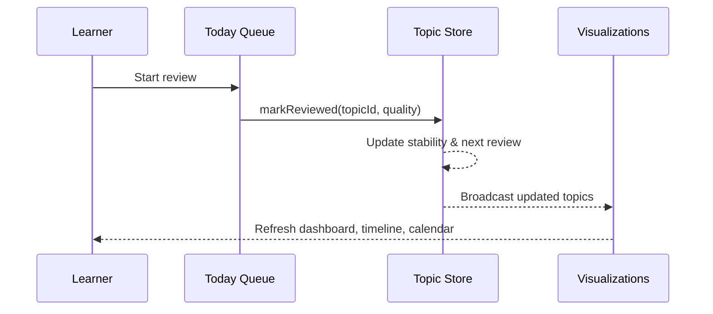


---

## Source: `SpacedRepetitionApp_Documentation.md`

### Diagram 1

*Description*: Mermaid diagram extracted from SpacedRepetitionApp_Documentation.md, diagram #1.

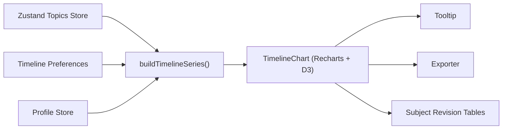

### Diagram 1

*Description*: Mermaid diagram extracted from SpacedRepetitionApp_Documentation.md, diagram #2.


### System Architecture

*Description*: Mermaid diagram extracted from SpacedRepetitionApp_Documentation.md, diagram #3.

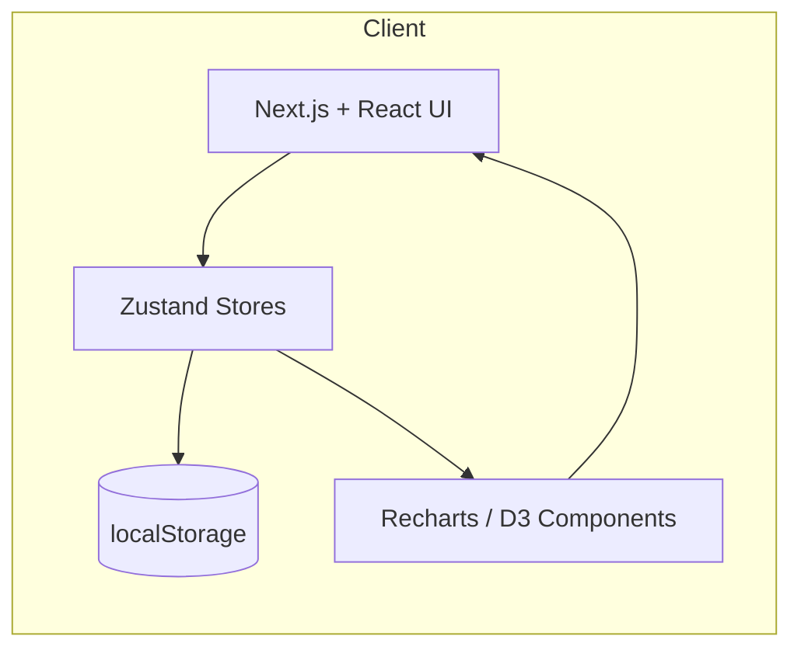

### Review Scheduling Data Flow

*Description*: Mermaid diagram extracted from SpacedRepetitionApp_Documentation.md, diagram #4.

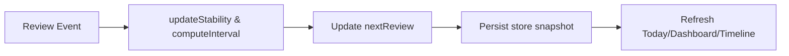

### Navigation Sitemap

*Description*: Mermaid diagram extracted from SpacedRepetitionApp_Documentation.md, diagram #5.

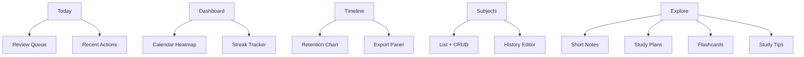

### Example UI Wireframe Layout

*Description*: Mermaid diagram extracted from SpacedRepetitionApp_Documentation.md, diagram #6.

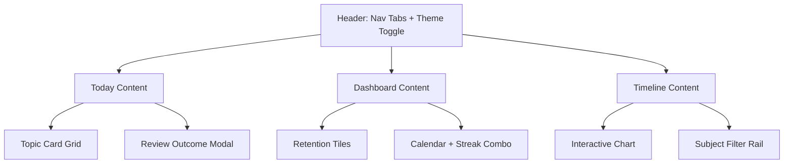


---

## Source: `docs/core/ALGORITHMS_FORGETTING_CURVE.md`

### Diagram 1

*Description*: Mermaid diagram extracted from docs/core/ALGORITHMS_FORGETTING_CURVE.md, diagram #1.


### History replay

*Description*: Mermaid diagram extracted from docs/core/ALGORITHMS_FORGETTING_CURVE.md, diagram #2.

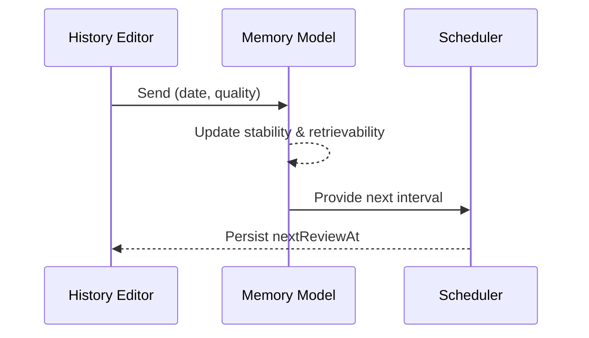


---

## Source: `docs/forgetting-curve.md`

### Diagram 1

*Description*: Mermaid diagram extracted from docs/forgetting-curve.md, diagram #1.

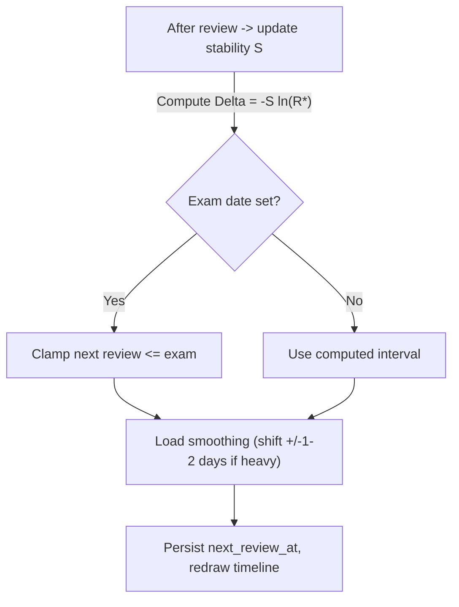

### Diagram 2

*Description*: Mermaid diagram extracted from docs/forgetting-curve.md, diagram #2.

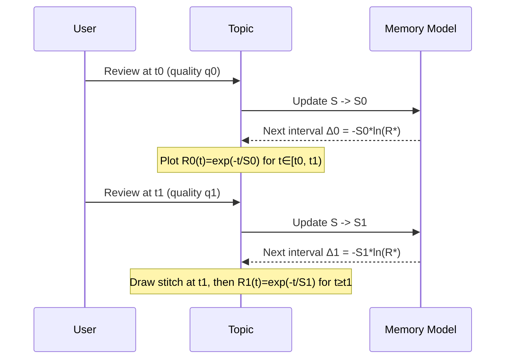

### Interval growth sanity

*Description*: Mermaid diagram extracted from docs/forgetting-curve.md, diagram #3.

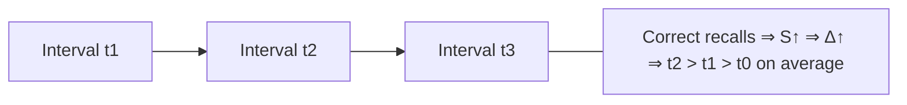

### Daily state machine

*Description*: Mermaid diagram extracted from docs/forgetting-curve.md, diagram #4.

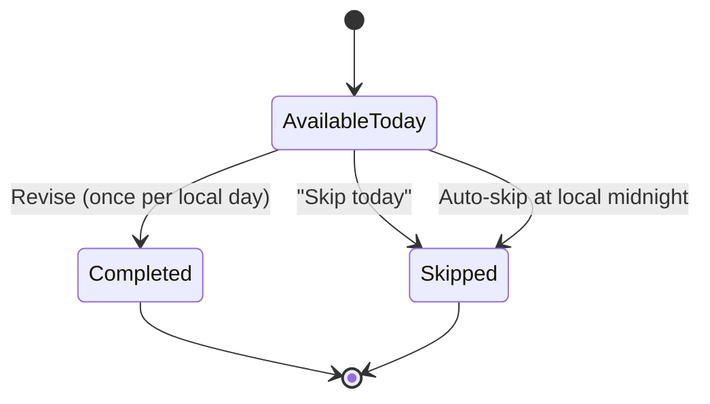


---

## Source: `docs/core/ARCHITECTURE.md`

### System context

*Description*: Mermaid diagram extracted from docs/core/ARCHITECTURE.md, diagram #1.

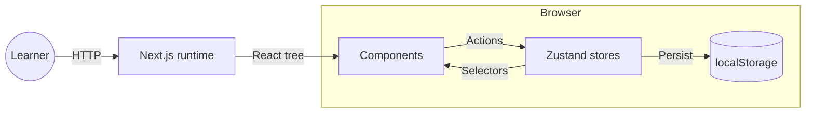

### Page shell

*Description*: Mermaid diagram extracted from docs/core/ARCHITECTURE.md, diagram #2.

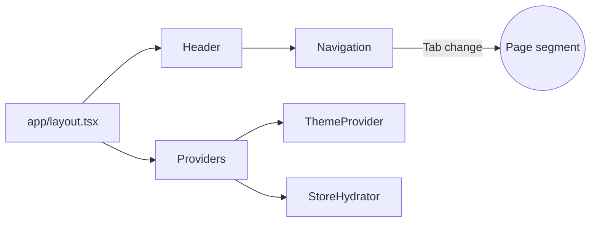

### Interaction loop

*Description*: Mermaid diagram extracted from docs/core/ARCHITECTURE.md, diagram #3.

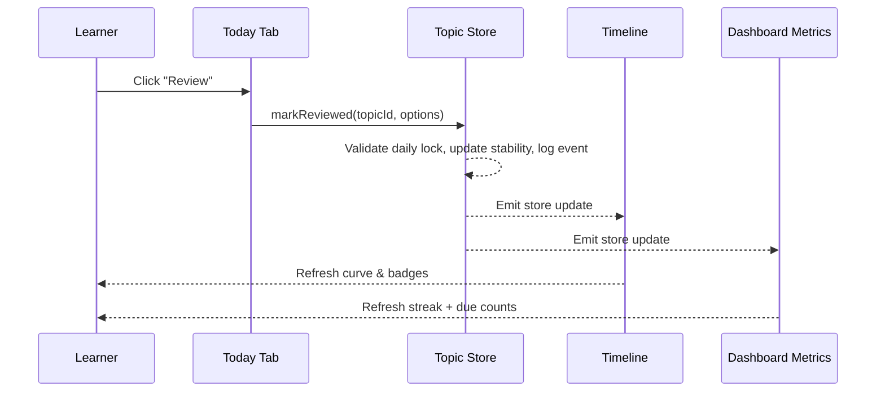


---

## Source: `docs/core/DATA_MODEL.md`

### Entities

*Description*: Mermaid diagram extracted from docs/core/DATA_MODEL.md, diagram #1.

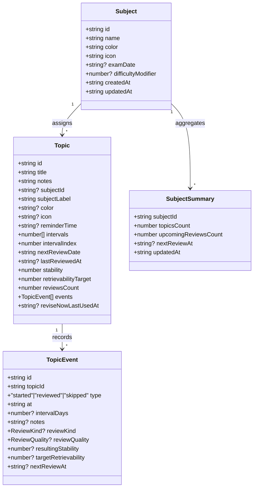


---

## Source: `docs/ui/NAVIGATION.md`

### Header layout

*Description*: Mermaid diagram extracted from docs/ui/NAVIGATION.md, diagram #1.

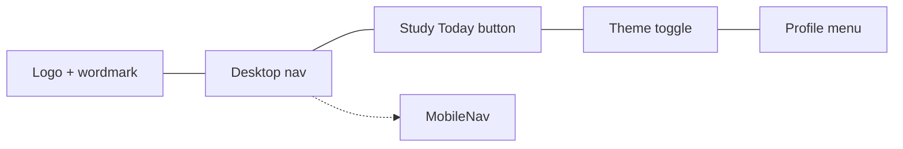


---

## Source: `docs/ui/UI_STYLE_AUDIT.md`

### Layout Shell Overview

*Description*: Mermaid diagram extracted from docs/ui/UI_STYLE_AUDIT.md, diagram #1.

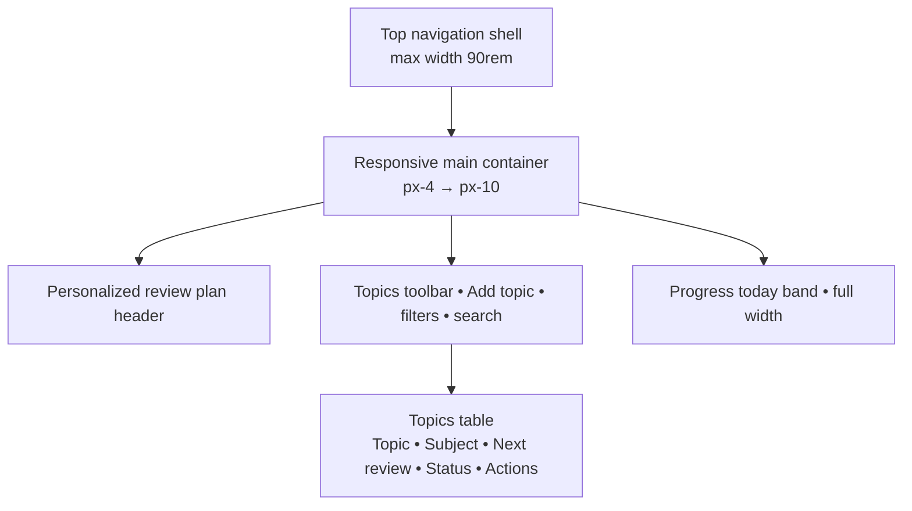

### Dashboard toolbar interactions

*Description*: Mermaid diagram extracted from docs/ui/UI_STYLE_AUDIT.md, diagram #2.

```mermaid
flowchart LR
  Search[/Search input<br>sessionStorage key dashboard-topic-search/] -- debounce 150ms --> Filter[Apply text filter]
  Filter --> Persist{Persist UI state}
  Status[Status chips<br>sessionStorage key dashboard-status-filter] --> Persist
  Subjects[Subjects menu<br>localStorage key dashboard-subject-filter] --> Persist
  Sort[Sort popover<br>sessionStorage key dashboard-topic-sort] --> Persist
  Persist --> TopicList[Topic table rows<br>Topic • Subject • Next review • Status • Actions]
  TopicList --> Summary[Results summary<br>Showing n of m topics]
  Summary --> ClearFilters[Clear filters pill]

```

### Calendar legend & day sheet

*Description*: Mermaid diagram extracted from docs/ui/UI_STYLE_AUDIT.md, diagram #3.

```mermaid
flowchart LR
  StoredFilter[Subjects dropdown<br/>localStorage key `dashboard-subject-filter`] --> CalendarGrid[Month grid<br/>subject-colored dots]
  StoredFilter --> DaySheet[Day sheet<br/>grouped by subject]
  ExamDates[Subject exam dates] --> CalendarGrid
  CalendarGrid --> Overflow[+N overflow badge<br/>tooltip lists all subjects]
  CalendarGrid --> Legend[Inline legend chips]
  DaySheet --> ReviseGate[Revise today only<br/>locks after local midnight]
```

### Timeline zoom, pan, and export

*Description*: Mermaid diagram extracted from docs/ui/UI_STYLE_AUDIT.md, diagram #4.

```mermaid
flowchart LR
  ZoomControls[Zoom buttons ±<br/>scroll / drag interactions] --> Domain[Active timeline domain]
  ResetButton[Reset button<br/>double-click canvas] --> Domain
  Domain --> TimelineChart[Timeline chart<br/>date-only axis]
  Domain --> ExamMarkers[Exam marker toggle<br/>dotted subject lines]
  TimelineChart --> Exports[Export SVG/PNG<br/>cloned current viewport]
  TimelineChart --> Screenreaders[SR hints<br/>pan & zoom instructions]
```


---

## Source: `docs/core/STATE_MANAGEMENT.md`

### Event timeline

*Description*: Mermaid diagram extracted from docs/core/STATE_MANAGEMENT.md, diagram #1.

```mermaid
sequenceDiagram
  participant C as Component
  participant A as Action
  participant P as Persist middleware
  participant L as localStorage
  participant S as Subscriber
  C->>A: invoke()
  A-->>A: mutate draft
  A->>P: enqueue write
  P->>L: JSON.stringify(state)
  P-->>S: notify subscribers
  S-->>C: rerender slice
```


---

## Source: `docs/core/THESIS.md`

### 3.1 Overview

*Description*: Mermaid diagram extracted from docs/core/THESIS.md, diagram #1.

```mermaid
%% Figure 3.1: UML component diagram
graph TD
  subgraph ClientApp
    AppRouter[Next.js App Router]
    Dashboard[Dashboard Layout]
    TimelinePanel[Timeline Panel Module]
    ReviewEngine[Review Engine]
    Exporter[Data Export Utilities]
  end
  subgraph State
    Store[Zustand Store]
    Persistence[Local IndexedDB Adapter]
  end
  subgraph Services
    Analytics[Timeline Analytics]
    Scheduler[Adaptive Scheduler]
  end
  AppRouter --> Dashboard
  Dashboard --> TimelinePanel
  TimelinePanel --> Analytics
  TimelinePanel --> Store
  ReviewEngine --> Scheduler
  Scheduler --> Store
  Store --> Persistence
  Exporter --> Store
  Dashboard --> ReviewEngine
```

### 3.2 Data Flow

*Description*: Mermaid diagram extracted from docs/core/THESIS.md, diagram #2.

```mermaid
%% Figure 3.2: Data flow diagram
graph LR
  User[User Actions]
  UI[Next.js Components]
  Actions[Zustand Actions]
  Store[(Zustand Store)]
  Serializer[Persistence Middleware]
  IndexedDB[(IndexedDB/Filesystem)]
  User --> UI --> Actions --> Store --> Serializer --> IndexedDB
  IndexedDB --> Serializer --> Store
```

### 3.3 Review Scheduling Workflow

*Description*: Mermaid diagram extracted from docs/core/THESIS.md, diagram #3.

```mermaid
%% Figure 3.3: Sequence diagram for scheduling
sequenceDiagram
  participant U as User
  participant TP as Timeline Panel
  participant RS as Review Scheduler
  participant ST as Zustand Store
  participant PR as Persistence Layer
  U->>TP: Select due card
  TP->>RS: Request schedule update(feedback)
  RS->>ST: Read item state
  RS->>RS: Compute new interval
  RS->>ST: Write updated schedule
  ST->>PR: Persist snapshot
  TP->>U: Render updated timeline
```

### 3.4 Timeline Interaction States

*Description*: Mermaid diagram extracted from docs/core/THESIS.md, diagram #4.

```mermaid
%% Figure 3.4: Zoom state machine
stateDiagram-v2
  [*] --> Idle
  Idle --> Hovering : pointer enters timeline
  Hovering --> DragSelecting : mousedown + drag
  DragSelecting --> Zoomed : mouseup
  Zoomed --> Hovering : reset zoom
  Hovering --> KeyboardZoom : keypress +/-
  KeyboardZoom --> Zoomed
  Zoomed --> Inspecting : focus event on marker
  Inspecting --> Zoomed : blur event
```

### 3.5 Timeline Intelligence

*Description*: Mermaid diagram extracted from docs/core/THESIS.md, diagram #5.

```mermaid
graph LR
    title["Retention Projection with Exam Markers"]

    A0["Day 0: Retention 0.95"]
    A7["Day 7: Retention 0.85"]
    A14["Day 14: Retention 0.72 (Exam)"]
    A21["Day 21: Retention 0.61 (Zoom + Exam)"]
    A28["Day 28: Retention 0.52 (Zoom)"]
    A35["Day 35: Retention 0.44"]
    A42["Day 42: Retention 0.38 (Exam)"]
    A49["Day 49: Retention 0.33"]

    A0 --> A7 --> A14 --> A21 --> A28 --> A35 --> A42 --> A49
```


---

## Source: `docs/core/TIMELINE.md`

### Render pipeline

*Description*: Mermaid diagram extracted from docs/core/TIMELINE.md, diagram #1.

```mermaid
flowchart LR
  Store[Topic store] --> Mapper[buildTimelineSeries]
  Preferences --> Mapper
  Profile --> Mapper
  Mapper --> Chart[TimelineChart]
  Chart --> Tooltip
  Chart --> MiniTables[Subject revision tables]
  Chart --> Exporter
```
